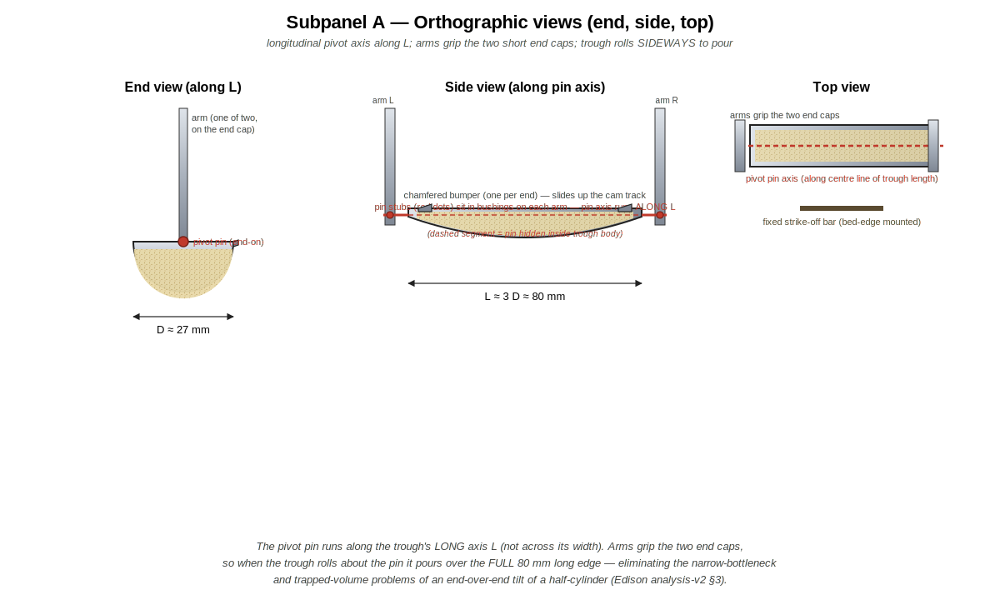
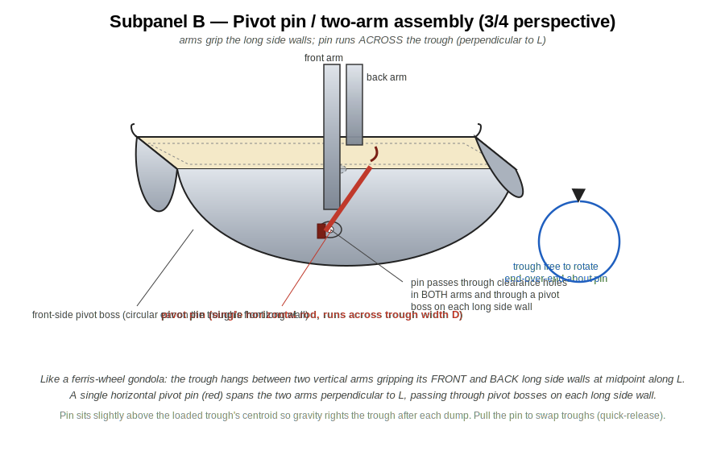
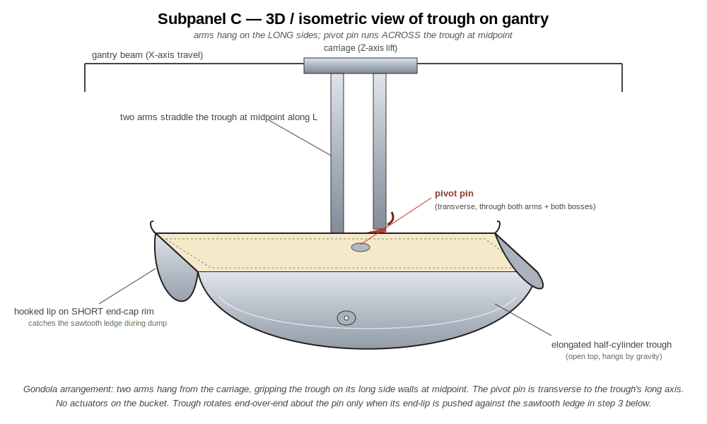
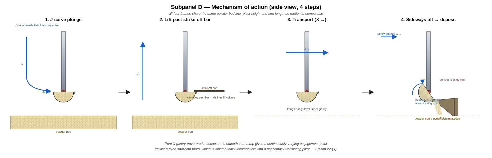
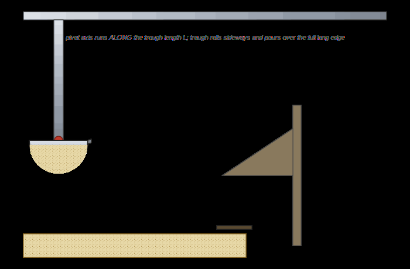

# powder-excavator

A pure-mechanical, gantry-mounted "ladle / trough" for picking up loose
powder from a bed and depositing it at a target location. The trough
hangs between two vertical arms exactly like a **ferris-wheel gondola**:
the arms grip the trough's two long side walls at midpoint, with a
single horizontal pivot pin running across the trough perpendicular to
its long axis. There are no actuators on the bucket itself — the
gantry's existing X / Z motion plus a fixed wall-mounted **sawtooth
ledge** (a horizontal bar at trough-end-lip height with a comb of teeth
on its top edge) does all the work.

## Original concept sketch

## Cleaned-up design diagram

The sketch above has been recreated as four labelled subpanels. Each is
a self-contained SVG with its own caption.

### Panel A — Orthographic views (end / side / top)

### Panel B — Pivot pin / two-arm assembly (detail)

### Panel C — 3D / isometric view of trough on gantry

### Panel D — Mechanism of action (3 steps)

### Animation — mechanism of action

A separate brainstorming &amp; prior-art writeup — framed roughly as the
introduction to a *Digital Discovery* manuscript on a new powder
dispenser, with references to recent SDL / powder-handling literature —
is in [`docs/brainstorming-and-literature.md`](docs/brainstorming-and-literature.md).

## Design brainstorming

### Core idea

The bucket is an **elongated half-cylinder trough** (think: a long,
narrow ladle with a semicircular cross-section and an open top). It is
suspended between **two parallel vertical arms** that hang from the
gantry carriage exactly like a **ferris-wheel gondola** hangs between
its two support arms. A **single horizontal pivot pin** runs across the
trough's *width* (perpendicular to its long axis L), passing through
clearance holes in both arms and through pivot bosses on the trough's
two **long side walls** at midpoint along L (panels B and C).

- The two arms are rigidly bolted to the carriage and **always stay
  vertical** during operation.
- The trough is the **only** part that ever rotates, and only about the
  pivot pin — tipping **end-over-end** when its hooked end-lip catches
  the sawtooth ledge.
- The pin sits slightly above the loaded trough's centre of mass, so
  gravity returns the trough to "open-up" once the dumping ledge is
  cleared (a stable pendulum / gondola).

Picking shape matters:

- A **half-cylinder** maximises the volume of powder retained per unit
  of "scoop depth", while presenting flat top edges (one rim along each
  long side) plus two short end-cap rims that are easy to give a
  **hooked end-lip** for engaging the sawtooth.
- An **elongated** trough (length L ≈ 3 × diameter D) lets us scoop a
  larger sample without a deeper plunge into the bed. It also gives
  the gondola arrangement a long lever arm: a small X-push from the
  gantry produces a useful torque about the pin.
- **No moving lid / hinge in the baseline design** — powder is held in
  by gravity alone, which keeps the part count and the failure modes to
  a minimum.

### Mechanism of action (3 steps — see Panel D)

1. **Dip down** — the gantry lowers the carriage straight down (Z↓) so
   the trough plunges into the powder bed and fills with material. Arms
   stay vertical; trough is open-up.
2. **Lift &amp; transport** — the carriage rises (Z↑); powder is retained
   in the open-top trough by gravity. The carriage then translates (X→)
   over to the deposit location. Arms still vertical, trough still open-up.
3. **Tip end-over-end → deposit** — the gantry pushes the trough
   sideways (X→) into a fixed, wall-/post-mounted **sawtooth ledge**
   positioned at trough-end-lip height. The hooked lip on the trough's
   short end-cap rim catches a sawtooth tooth, and continued X-travel
   applies a torque about the pivot pin that **rotates only the trough
   end-over-end** (one end drops, the other rises — like a ferris-wheel
   gondola pushed past horizontal). Powder slides out the lowered end
   at a controlled X-coordinate. Backing the carriage off lets gravity
   right the trough (open-up) under its pendulum action.

The "push against a wall to dump" trick is what makes this fully
mechanical — no servo / solenoid is needed on the bucket itself.

### What is the sawtooth ledge?

A **fixed, wall- or post-mounted horizontal bar** at roughly trough-
*end*-lip height, with a comb of triangular teeth along its top edge
(see Panel D, Step 3, and the GIF above). It is *not* on the floor of
the powder bed and is *not* part of the moving assembly. The trough's
hooked end-lip slides past the teeth as the gantry pushes it in X;
when the lip drops behind a tooth, continued X-travel applies a
moment about the transverse pivot pin that tilts the trough end-over-
end.

Why teeth and not a smooth bar?

- The teeth give a **positive, repeatable engagement point** for the
  bucket lip, so the tilt angle is determined by geometry, not by how
  hard the gantry is pushing.
- Multiple teeth across the ledge let the deposit position be chosen
  by which X-coordinate the bucket is pushed against — useful if we
  want to deposit at several spots without a separate dump station.
- A comb (rather than a smooth ledge) helps **break up clumps** as the
  bucket tips, producing a more uniform pour.

### Open questions / things to prototype

- **Manufacturing.** Target is a **3D-printable** trough + arms +
  bosses (PETG / nylon for the prototype, with a glued-in metal sleeve
  for the pin holes if wear becomes an issue). The pivot pin itself
  is a stock dowel pin / shoulder bolt. The sawtooth ledge can be
  printed too. This keeps the BoM low and lets us iterate on geometry
  cheaply. A machined-aluminium revision would only be needed if the
  printed parts wear or charge problematically.
- **Target powders are dozens-of-microns in diameter** — catalysts,
  ceramics, salts. Many of these are cohesive, hygroscopic, and/or
  triboelectrically charged; some clump and resist removal from a
  scoop. This drives several of the open questions below:
- **Trough geometry.** Pure semicircle vs. a slightly deeper "U" or a
  V-bottom — which retains powder best while still pouring cleanly when
  tilted? Worth a quick CAD + 3D-print bake-off across our worst-case
  cohesive powders.
- **Surface finish &amp; static.** A smooth, conductive, polished
  interior helps with sticky/tribocharging powders. For 3D-printed
  parts this might mean a vapour-smoothing pass (PETG / ABS) or an ESD-
  safe filament; for an aluminium revision, hard-anodised or polished.
- **Lip profile.** A thin, slightly hooked end-lip will engage the
  sawtooth ledge more reliably; a chamfered lip will pour more
  cleanly. The same end-lip serves both roles in the baseline; if the
  trade-off is too tight we may end up with two different end-lips
  (one on each end), or hooks on both ends to make the dump
  reversible.
- **Repeatability of dose.** How consistent is the scooped volume?
  Likely needs a **strike-off bar** mounted at the bed edge that the
  bucket passes under on the way out, to wipe excess powder back into
  the bed.
- **Powder retention during transport.** For very fine / fluffy
  powders, an open trough may shed material. Options: (a) move slowly,
  (b) add a passive flap that closes under its own weight when the
  bucket is upright, (c) accept some loss and characterise it.
- **Clump-breaking on the way out.** Cohesive powders may bridge over
  the trough mouth even when tilted. The sawtooth teeth themselves
  help, but a brief overshoot-and-snap-back motion driven by the
  gantry may be needed.
- **Deposit precision.** If we need a tight pile rather than a line, a
  shorter trough (smaller L/D) or a funnel under the ledge may help.
- **Cleaning / cross-contamination.** For multi-material campaigns we
  probably want a quick-release mount so the trough can be swapped out
  between runs. The pivot pin is already the natural release point —
  pull the pin, swap the trough, re-insert.

### Possible variations (all still pure-mechanical)

- **Reversible tip** — sawtooth ledges on both sides of the work area
  let the same bucket dump left or right by which way it's pushed.
- **Two troughs back-to-back** — one fills while the other is being
  dumped, doubling throughput with no extra actuators.
- **Auger / screw inside the trough** — adds one rotary actuator but
  gives controlled metered dosing instead of "dump it all".
- **Passive flap lid for fine powders.** A lightweight flap hinged on
  the trough's upper edge that gravity holds *closed* over the mouth
  while the trough hangs open-up (so fluffy powder is not shed during
  X-travel). When the trough rotates against the sawtooth ledge in
  step 3, a small projection on the flap strikes a separate fixed
  tang on the same ledge assembly, swinging the flap clear so powder
  can pour out. Returns to closed under gravity once the trough
  returns upright. Still purely mechanical — no actuator on the bucket.
