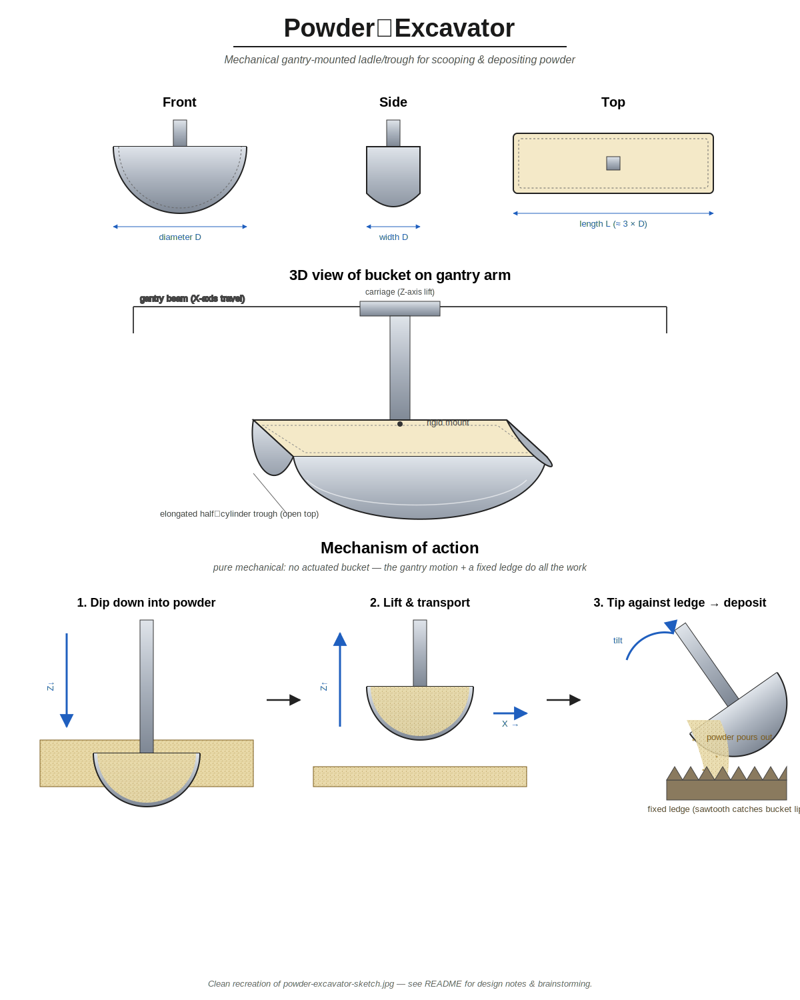

# powder-excavator

A pure-mechanical, gantry-mounted "ladle / trough" for picking up loose
powder from a bed and depositing it at a target location. There are no
actuators on the bucket itself — the gantry's existing X / Z motion plus
a fixed sawtooth ledge do all the work.

## Original concept sketch

## Cleaned-up design diagram

A cleaned-up recreation of the sketch above (orthographic views, a 3D
view, and a step-by-step mechanism of action) lives in
[`docs/powder-excavator-design.svg`](docs/powder-excavator-design.svg):

## Design brainstorming

### Core idea

The bucket is an **elongated half-cylinder trough** (think: a long,
narrow ladle with a semicircular cross-section and an open top), rigidly
attached to a **vertical arm** hanging from a gantry carriage.

Picking shape matters:

- A **half-cylinder** maximises the volume of powder retained per unit
  of "scoop depth", while presenting a flat top that is easy to mount
  to a vertical arm.
- An **elongated** trough (length L ≈ 3 × diameter D) lets us scoop a
  larger sample without needing a deeper plunge into the bed.
- **No moving lid / hinge**: powder is held in by gravity alone, which
  keeps the part count and the failure modes to a minimum.

### Mechanism of action (3 steps)

1. **Dip down** — the gantry lowers the arm straight down (Z↓) so the
   trough plunges into the powder bed and fills with material.
2. **Lift & transport** — the arm rises (Z↑); powder is retained in the
   open-top trough by gravity. The carriage then translates (X→) over
   to the deposit location.
3. **Tip against ledge → deposit** — the arm is driven into a fixed
   wall-mounted **ledge** with a sawtooth / comb top edge. The teeth
   catch the bucket's lip and force the trough to **tilt** as the arm
   continues to push, pouring the powder out into a controlled spot.

The "push against a wall to dump" trick is what makes this fully
mechanical — no servo / solenoid is needed on the bucket itself.

### Why the sawtooth ledge?

- The teeth give a **positive, repeatable engagement point** for the
  bucket lip, so the tilt angle is determined by geometry, not by how
  hard the gantry is pushing.
- Multiple teeth across the ledge let the deposit position be chosen
  by which X-coordinate the bucket is pushed against — useful if we
  want to deposit at several spots without a separate dump station.
- A comb (rather than a smooth ledge) helps **break up clumps** as the
  bucket tips, producing a more uniform pour.

### Open questions / things to prototype

- **Material & finish.** Anodised aluminum or stainless? Powders can be
  sticky / tribocharging — a smooth, conductive, polished interior is
  probably worth the cost.
- **Trough geometry.** Pure semicircle vs. a slightly deeper "U" or a
  V-bottom — which retains powder best while still pouring cleanly when
  tilted? Worth a quick CAD + 3D-print bake-off.
- **Lip profile.** A thin, slightly hooked lip will engage the sawtooth
  ledge more reliably; a chamfered lip will pour more cleanly. We may
  need both (hook on one long edge, chamfer on the other).
- **Repeatability of dose.** How consistent is the scooped volume? May
  need a **leveling/strike-off bar** mounted at the bed edge that the
  bucket passes under on the way out, to wipe excess powder back into
  the bed.
- **Powder retention during transport.** For very fine / fluffy
  powders, an open trough may shed material. Options: (a) move slowly,
  (b) add a passive flap that closes under its own weight when the
  bucket is upright, (c) accept some loss and characterise it.
- **Deposit precision.** If we need a tight pile rather than a line, a
  shorter trough (smaller L/D) or a funnel under the ledge may help.
- **Cleaning / cross-contamination.** For multi-material campaigns we
  probably want a quick-release mount so the trough can be swapped out
  between runs.

### Possible variations (all still pure-mechanical)

- **Reversible tip** — sawtooth ledges on both sides of the work area
  let the same bucket dump left or right by which way it's pushed.
- **Two troughs back-to-back** — one fills while the other is being
  dumped, doubling throughput with no extra actuators.
- **Auger / screw inside the trough** — adds one rotary actuator but
  gives controlled metered dosing instead of "dump it all".
- **Spring-loaded flap lid** that is pushed open by the same ledge that
  tips the bucket, for cleaner transport of fine powders.
