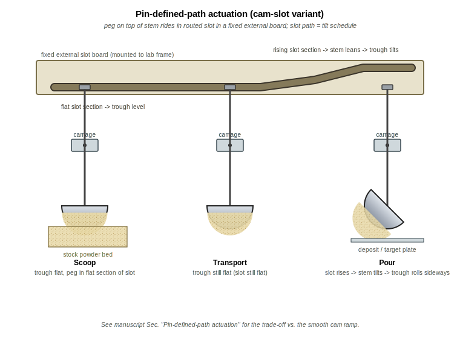

# powder-excavator

A pure-mechanical, gantry-mounted "ladle / trough" for picking up loose
powder from a bed and depositing it at a target location. The trough is
suspended between two vertical arms that grip its **two short end caps**;
a single **longitudinal pivot pin** runs through both end caps along the
trough's long axis L. There are no actuators on the bucket itself — the
gantry's existing X / Z motion plus a fixed wall-/post-mounted **smooth
inclined cam ramp** does all the work.

> **Geometry note (post-review).** An earlier revision of this design used
> a **transverse** pivot pin (running across the trough's width D) and
> tipped the trough **end-over-end** against a **sawtooth** ledge. Both
> choices were retired after a high-effort review by Edison Scientific
> identified (i) a kinematic impossibility — a fixed sawtooth tooth
> cannot engage a fixed-radius hook on a horizontally-translating pivot
> without the lip plunging through the tooth — and (ii) a severe trapped-
> volume / arching problem when cohesive powders are forced to bottleneck
> through the narrow ~13 mm spill point of an end-over-end half-cylinder.
> The current design uses a **longitudinal** pivot pin and **sideways
> tilt** so powder pours over the full 80 mm long edge, and replaces the
> sawtooth with a **smooth cam ramp** that the trough's chamfered bumper
> slides up. A follow-on hand sketch
> ([`PXL_20260423_231729467.jpg`](PXL_20260423_231729467.jpg)) refines the
> cam ramp into a **pin-defined-path** (peg-in-routed-slot) variant in
> which a peg on a stem hanging from the gantry is captured in a slot
> routed into a fixed external board, so the slot path deterministically
> programs the trough's tilt schedule. The full review and the verbatim
> Edison answers live in [`docs/edison/`](docs/edison/); the
> literature-aware brainstorming doc has been ported to a LaTeX manuscript
> with a proper BibTeX bibliography (see
> [`docs/manuscript/main.tex`](docs/manuscript/main.tex) and
> [`docs/manuscript/refs.bib`](docs/manuscript/refs.bib); build with
> `cd docs/manuscript && make`).

## Original concept sketch


## Cleaned-up design diagram

The sketch above has been recreated as four labelled subpanels. Each is a
self-contained SVG with its own caption. All four are produced (along with
the mechanism animation below) by a single reproducible script,
[`scripts/generate_figures.py`](scripts/generate_figures.py).

### Panel A — Orthographic views (end / side / top)


### Panel B — End-cap pivot detail


### Panel C — 3D / isometric view of trough on gantry


### Panel D — Mechanism of action (4 steps)


### Panel E — Pin-defined-path actuation variant

A follow-on hand sketch
([`PXL_20260423_231729467.jpg`](PXL_20260423_231729467.jpg)) refines the
smooth cam ramp into a peg-in-routed-slot mechanism. A vertical stem hangs
from the gantry carriage on a pin pivot; a transverse peg at the top of the
stem rides in a slot routed into a fixed external board. The slot's shape
over `X` deterministically programs the trough's tilt schedule, with the peg
captive in the slot for the entire stroke (no approach-and-contact
ambiguity, and bidirectional return without relying on gravity). See
[`docs/manuscript/main.tex`](docs/manuscript/main.tex) §"Pin-defined-path
actuation" for the full trade-off discussion.



### Animation — cam-engagement and sideways tilt


The full literature-aware design discussion — framed roughly as the
introduction to a *Digital Discovery* manuscript on a new powder
dispenser, with references to recent SDL / powder-handling literature —
is now a LaTeX manuscript with a proper BibTeX bibliography:
[`docs/manuscript/main.tex`](docs/manuscript/main.tex),
[`docs/manuscript/refs.bib`](docs/manuscript/refs.bib). Build with
`cd docs/manuscript && make` (requires `pdflatex`, `bibtex`, and
`cairosvg`).

## Parametric CAD pipeline ([`cad/`](cad/))

The same dimensions used in the figures and the manuscript also drive an
**open, scriptable parametric CAD model** built on
[CadQuery](https://github.com/CadQuery/cadquery), so the design can be
iterated as plain Python source and exported to STEP / STL for any
open-source slicer. A small `cad/dfm.py` runs design-for-manufacturing and
**gantry-only kinematics** checks (the explicit constraint from PR comment
4166621470 — "we have a gantry system and would like to avoid installing a
second axis"), so a parameter regression is caught the next time anyone
edits `ExcavatorParams`. See [`cad/README.md`](cad/README.md) for the
rationale (why CadQuery over Rhino / Grasshopper / Fusion / nTop) and the
full feedback-loop description.

```bash
pip install cadquery
python -m cad.build      # writes STEP + STL + manifest into cad/build/
python -m cad.dfm        # design-for-manufacturing + gantry-only kinematics checks
python -m unittest discover cad/tests -v
```


## Design brainstorming

### Core idea

The bucket is an **elongated half-cylinder trough** (think: a long,
narrow ladle with a semicircular cross-section and an open top). It is
suspended between **two parallel vertical arms** that hang from the
gantry carriage and grip the trough on its **two short end caps**. A
**single horizontal pivot pin** runs from one arm, through a printed
boss in the first end cap, lengthwise along L through the trough, out
through a matching boss in the second end cap, and into the second arm
(panels B and C). The pivot axis is therefore **parallel to the
trough's long axis L** — the trough rolls about that axis like a
spit-roast rotating about its skewer.

- The two arms are rigidly bolted to the carriage and **always stay
  vertical** during operation.
- The trough is the **only** part that ever rotates, and only about the
  longitudinal pin — rolling **sideways** when its rim-mounted bumper
  catches the cam ramp. Powder pours over the **full 80 mm long edge**,
  not through a narrow end-cap point.
- The pin sits a few millimetres above the loaded trough's centre of
  mass, so gravity returns the trough to "open-up" once the dump cam is
  cleared (a stable pendulum / gondola-style pivot).

Picking shape matters:

- A **half-cylinder** maximises retained volume per unit "scoop depth"
  while presenting a long flat top edge that pours uniformly along its
  whole length.
- An **elongated** trough (length L ≈ 3 × diameter D) gives the spill
  edge a large area (≈ L × few-mm depth) so cohesive powders cannot
  arch across it, eliminating the bottleneck/bridging failure mode of
  an end-over-end tilt of the same trough (Edison v2 §3).
- **No moving lid / hinge in the baseline design** — powder is held in
  by gravity alone, which keeps the part count and the failure modes to
  a minimum.

### Mechanism of action (4 steps — see Panel D)

1. **J-curve plunge into the bed.** The gantry lowers the carriage
   (Z↓) so the trough enters the powder bed, then translates a few
   millimetres in X while continuing down — a shallow J-curve rather
   than a pure Z-plunge. A blunt flat half-cylinder driven straight
   down compresses the bed underneath it instead of flowing in (Edison
   v1 §2); the J-curve lets powder spill into the open top as the
   bucket sweeps forward.
2. **Lift past the strike-off bar.** The carriage rises (Z↑) along an
   X-coordinate that takes the rim of the trough **under a fixed bed-
   edge strike-off bar**. The bar wipes the heaped powder back into the
   bed and leaves a defined fill volume. Without this step, dose CV
   sits in the 15–30 % range across powder classes (Edison v2 §4); with
   it, ≈10 % CV is realistic on cohesive inorganics — comparable to the
   positive-displacement-pipette baseline reported by Alsenz (see
   [`docs/manuscript/main.tex`](docs/manuscript/main.tex)).
3. **Transport to the deposit X.** The carriage translates in X over to
   the deposit station. Arms still vertical; trough still open-up,
   level under gravity.
4. **Sideways tilt against the cam → deposit.** The gantry pushes the
   trough in X into a fixed, wall-/post-mounted **smooth inclined cam
   ramp** at end-cap-rim height. The chamfered bumper on the trough's
   long-side rim **slides up the cam's hypotenuse**; because the cam
   surface is a continuous incline rather than a fixed point, pure-X
   gantry travel is geometrically compatible with the resulting roll of
   the trough about its longitudinal pin (Edison v2 §1). Continued
   X-push rolls the trough sideways and powder pours over the **full
   long edge**. Backing the carriage off lets gravity right the trough
   under its pendulum action.

The "push against a cam to dump" trick is what makes this fully
mechanical — no servo / solenoid is needed on the bucket itself.

### What is the cam ramp?

A **fixed, wall- or post-mounted inclined block** at roughly trough-
end-cap-rim height (see Panel D, Step 4, and the GIF above). Its top
surface is a **smooth ramp** (a chamfered, ideally polished
hypotenuse), *not* a comb of teeth. It is *not* on the floor of the
powder bed and is *not* part of the moving assembly. The trough's rim
bumper rides up the ramp as the gantry pushes the carriage in X; the
height the bumper reaches up the ramp (set by how far in X the gantry
pushes) determines the tilt angle and therefore how much powder is
poured.

Why a smooth ramp and not a sawtooth?

- **Kinematic compatibility.** A fixed sawtooth tooth cannot engage a
  fixed-radius hook on a horizontally-translating pivot pin without the
  lip having to plunge through the tooth — the pin-to-tooth distance
  must change as the pivot moves in X, but the hook's radius is fixed.
  An inclined cam removes the constraint entirely: the contact point
  slides continuously along the cam surface as the gantry travels
  (Edison v2 §1).
- **Continuous tilt control.** With a smooth ramp, the tilt angle is a
  continuous function of gantry X position, so pour rate and final
  dose can be modulated in software without changing hardware.
- **No catch-and-skip failure mode.** A printed sawtooth tooth and a
  printed hook can mis-engage, snag, or skip; a chamfered bumper on a
  smooth incline cannot.

### Optional: knock-to-de-bridge

Because the bumper is in continuous frictional contact with the cam
during the tilt, the gantry can be driven to **rapidly oscillate ±2 mm
in X** while the bumper is engaged. This momentarily slams the trough
against the cam and acts as a free pneumatic-knocker analogue to break
up bridges of cohesive powder that would otherwise refuse to pour
(Edison v1 §6). It is a software-only feature — the same hardware that
performs the tilt also performs the knock.

### Open questions / things to prototype

- **Manufacturing.** Target is a **3D-printable** trough + arms + end-
  cap pivot bosses (PETG / nylon for the prototype, with a glued-in
  brass sleeve for the pin holes if wear becomes an issue). The pivot
  pin itself is a stock dowel pin or shoulder bolt, ideally **metal**
  so it can also serve as the ground path for an optional conductive
  trough lining (e.g. interior copper tape) that mitigates triboelectric
  charging on fine dry inorganics (Edison v1 §2). The cam ramp can be
  printed too. A machined-aluminium revision would only be needed if
  the printed parts wear or charge problematically.
- **Target powders are dozens-of-microns in diameter** — catalysts,
  ceramics, salts. Many are cohesive, hygroscopic, and/or
  triboelectrically charged; some clump and resist removal from a
  scoop. This drives several of the open questions below.
- **Trough geometry sweep.** Pure semicircle vs. a slightly deeper "U"
  vs. a V-bottom — which retains powder best while still pouring
  cleanly when rolled? A 3D-printed bake-off across our worst-case
  cohesive powders is cheap.
- **Cam-ramp angle sweep.** Cam slope, length, and surface finish are
  the three knobs most likely to dominate dose CV. Steeper slopes give
  more aggressive tilts per unit gantry travel but risk bumper slip;
  shallower slopes give finer control but a longer dump stroke.
- **Strike-off bar profile.** Square cross-section vs. a chamfered or
  rounded leading edge — which leaves the cleanest fill at the rim
  without flicking powder away? Worth varying.
- **Bumper profile.** Chamfer angle and surface finish on the rim
  bumper directly affect cam engagement; too sharp and it digs in,
  too rounded and it slips. Print + sand a small set and characterise.
- **Bed depletion.** Repeated scoops from the same X, Y in a static
  bed will form a crater and the dose will decay (Edison v1 §3). The
  gantry must raster the plunge X, Y across the bed, or a separate
  "bed-stir" cycle must be added.
- **Cleaning / cross-contamination.** For multi-material campaigns the
  pivot pin is the natural quick-release point — pull the pin, swap the
  trough, re-insert. For very sticky powders a **per-material
  consumable trough** (snap-in printed liner) may be cheaper than
  cleaning.
- **Use-environment caveat.** A bulk-transfer scoop unavoidably
  exposes the powder to ambient air during transport and leaves an
  open crater in the stock bed. For hygroscopic salts this is a real
  limitation; the device's intended envelope is **bulk transfer in
  ambient or globally-controlled environments (e.g. inside a glovebox
  or on a benchtop with a desiccated stock container)**, not as a
  direct loader for highly moisture-sensitive workflows.

### Possible variations (all still pure-mechanical)

- **Reversible tilt** — cam ramps on both sides of the work area let
  the same bucket dump left or right by which way it's pushed.
- **Two troughs back-to-back** — one fills while the other is being
  dumped, doubling throughput with no extra actuators.
- **Auger / screw inside the trough** — adds one rotary actuator but
  gives controlled metered dosing instead of "tilt and pour all".
- **Passive flap lid for fine powders.** A lightweight flap hinged on
  the trough's long upper edge that gravity holds *closed* over the
  mouth while the trough hangs open-up (so fluffy powder is not shed
  during X-travel). When the trough rolls against the cam ramp in
  step 4, a small projection on the flap strikes a separate fixed tang
  on the same cam assembly, swinging the flap clear so powder can
  pour out. Returns to closed under gravity once the trough returns
  upright. Still purely mechanical — no actuator on the bucket.

### Acknowledgements

The design changes between PR #2 and the present revision were prompted
by a high-effort design review from [Edison Scientific](https://edisonscientific.com/),
plus a literature search via the same service. Verbatim responses are
archived under [`docs/edison/`](docs/edison/) for traceability.
