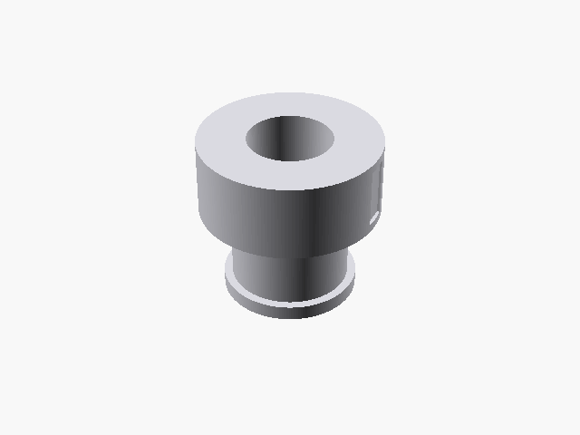
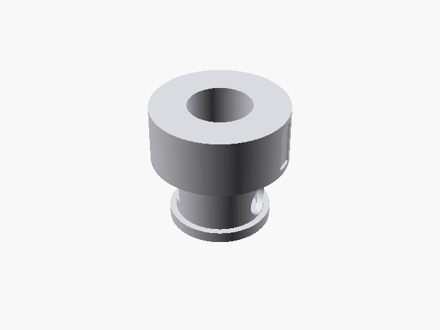
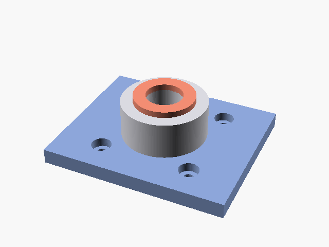

# Printing & prototyping the alternative-dosing top-ranked sieve cup

This folder contains the parametric, printable CAD for the **two
top-ranked alternative powder-dosing concepts** from
[`docs/alternative-dosing/brainstorm.md`](../docs/alternative-dosing/brainstorm.md):

- **Concept G — ERM-augmented sieve cup** (rank 1 in the
  Edison-revised ranking).
- **Concept A — tap-driven sieve cup** (rank 2; same printed cup,
  fully passive, gantry-as-actuator).

Both share the **same parametric body** so a single SCAD file emits
either variant by toggling one flag. A separate, small bed-mounted
**anvil** is provided for concept A.

It's everything you need to take the design from "interesting plot
in a PR" to "physical part on a 3018-Pro V2 gantry tonight" — the
same procedure used in PR #2 (cam-ramp scoop) and PR #5 (bimodal
trough), and the toolchain agreed in PR #7 (OpenSCAD source +
PrusaSlicer CLI for FDM, FreeCAD Path / Kiri:Moto for CNC, manual
sweeps + pandas for design-space exploration, no Optuna /
Ax-BoTorch yet).

## Files

| File | What it is |
| ---- | ---------- |
| [`sieve_cup.scad`](sieve_cup.scad) | Parametric source, OpenSCAD 2021.01+. Two-in-one: `-D 'erm_motor_pocket=false'` renders concept A, `-D 'erm_motor_pocket=true'` renders concept G. Every dimension is exposed as a top-of-file variable. |
| [`tap_anvil.scad`](tap_anvil.scad) | Parametric source for the bed-mounted anvil that concept A pecks against. Bolts to the 3018-Pro V2 T-slot bed on a 30 × 30 mm M3 hole pattern; central bore receives the dispensed powder into a 15 mm vial. |
| [`sieve-cup.stl`](sieve-cup.stl) | Concept-A (passive) ready-to-slice mesh. Manifold (CGAL `Simple: yes`), 1 874 facets, ≈ 32 × 32 × 40 mm. |
| [`sieve-cup-erm.stl`](sieve-cup-erm.stl) | Concept-G ready-to-slice mesh (adds an ERM pocket + CR2032 holder pocket). Manifold, 2 104 facets. |
| [`tap-anvil.stl`](tap-anvil.stl) | Bed-mounted anvil. Manifold, 892 facets, 60 × 50 × 19 mm. |
| `sieve-cup{,-erm}-iso.png` | Isometric preview renders. |
| [`sieve-cup-spin.gif`](sieve-cup-spin.gif) | 360° turntable spin of concept A — generated by [`scripts/render_sieve_cup.py`](../scripts/render_sieve_cup.py). |
| [`sieve-cup-erm-spin.gif`](sieve-cup-erm-spin.gif) | 360° turntable spin of concept G. |
| [`tap-anvil-spin.gif`](tap-anvil-spin.gif) | 360° turntable spin of the anvil. |

| Concept A (passive) | Concept G (with ERM pocket) | Tap anvil |
| --- | --- | --- |
|  |  |  |

## Re-rendering from source

```bash
sudo apt-get install -y openscad xvfb        # one-time, ~80 MB
pip install pillow

# Concept A (passive, gantry-tap-driven)
openscad -o cad/sieve-cup.stl \
         -D 'erm_motor_pocket=false' cad/sieve_cup.scad
openscad -o cad/sieve-cup-iso.png \
         --imgsize=1100,800 \
         --camera=0,0,18,55,0,25,260 \
         --colorscheme=Tomorrow \
         -D 'erm_motor_pocket=false' cad/sieve_cup.scad

# Concept G (adds ERM motor pocket + coin-cell holder pocket)
openscad -o cad/sieve-cup-erm.stl \
         -D 'erm_motor_pocket=true'  cad/sieve_cup.scad
openscad -o cad/sieve-cup-erm-iso.png \
         --imgsize=1100,800 \
         --camera=0,0,18,55,0,25,260 \
         --colorscheme=Tomorrow \
         -D 'erm_motor_pocket=true'  cad/sieve_cup.scad

# Bed-mounted anvil (only used for concept A)
openscad -o cad/tap-anvil.stl     cad/tap_anvil.scad
openscad -o cad/tap-anvil-iso.png \
         --imgsize=1100,800 \
         --camera=0,0,8,55,0,25,200 \
         --colorscheme=Tomorrow   cad/tap_anvil.scad

# 360° turntable spins (uses xvfb-run automatically on headless machines)
python -m scripts.render_sieve_cup --variant passive
python -m scripts.render_sieve_cup --variant erm
python -m scripts.render_sieve_cup --variant anvil
```

## See also

The full design-doc — mechanism rationale, parameter table, slicer
settings, mounting, dose-calibration recipe drawn from the published
vibratory-sieve-chute literature (Besenhard 2015) and the PowderPicking
analogue (Alsenz 2011), and a build-day timeline — is at
[`docs/preliminary-design-sieve-cup.md`](../docs/preliminary-design-sieve-cup.md).

The brainstorm that produced these two designs and the Edison
literature critique that promoted G above A are in
[`docs/alternative-dosing/`](../docs/alternative-dosing/).
