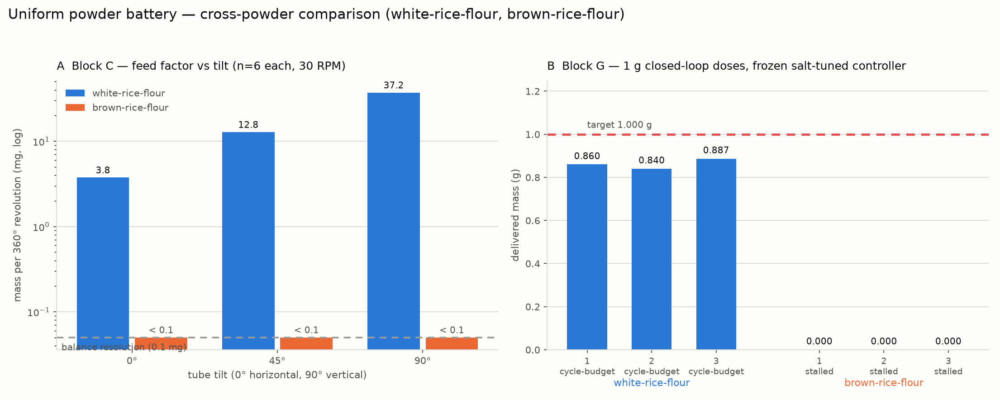

# Battery run — brown rice flour (re-run), 2026-08-04

Third run of the uniform powder test battery (issue #116), and the second
attempt at brown rice flour. The [first attempt](2026-08-04-brown-rice-flour.md)
was condemned because the delivery end was believed to be taped, which is
indistinguishable from cohesion on the balance. @swcharles reloaded the auger
and confirmed the tape was off, reporting visible clumping in the powder.

> **Amended 2026-08-05** — the coupler slip that this document calls "the
> single unverified link in the chain" has been **ruled out**, and the hand
> test it asks for has been done: 20 rotations by hand, off the rig, delivered
> 0.0019 g. The verdict changed from `cohesive-no-flow` to
> `no-conveyance-auger-suspect` — the measurement is sound, but powder-vs-
> auger-print is unresolved pending a re-test in a fresh auger. See
> [2026-08-05-brown-rice-flour-amendment.md](2026-08-05-brown-rice-flour-amendment.md).
>
> **Resolved 2026-08-05** — the flour was moved to a **second, independently
> printed auger** and the battery re-run. It behaves the same (0.20–0.30 mg per
> revolution, versus < 0.1 mg here), so the auger-print hypothesis is not
> supported and the near-zero feed factor is a property of the powder. That run
> supersedes this one for cross-powder comparison:
> [2026-08-05-brown-rice-flour-auger2.md](2026-08-05-brown-rice-flour-auger2.md).

| | |
|---|---|
| Run directory | [`data/battery/20260804T224937Z_brown-rice-flour/`](../../data/battery/20260804T224937Z_brown-rice-flour) |
| MongoDB | `powder_doser.battery_runs`, `_id` `6a726e25e3fbe78b9a11239c` |
| Powder | brown rice flour (`batch: food-safe-2026-08`) |
| Loaded by | @swcharles |
| Blocks run | A, B, C, D, E, G (F skipped — vibration motor not attached) |
| Wall clock | 22:49:37 → 22:56:35 UTC (7 min) |
| **QC verdict** | **`cohesive-no-flow` — not valid for cross-powder comparison** |

## Pre-flight, and why it was escalated

The [pre-flight feed check](../powder-battery-protocol.md) came back flat, so
the [escalating diagnostic](../../hardware/test-module/firmware/battery_feed_diagnostic.py)
was run to try to separate cohesion from a blocked path. All of it at tilt 90°,
the most favourable geometry.

| Test | Rotation | Delivered |
|---|---|---|
| Pre-flight, 5 × 360° @ 30 RPM | 5 rev | 0.0000 g |
| Escalation, 10 rev @ 60 RPM continuous | 10 rev | 0.0005 g |
| Escalation, 10 rev @ 90 RPM continuous | 10 rev | 0.0010 g |
| Escalation, 3 × (20 taps → 5 rev @ 30 RPM) | 15 rev | 0.0010 g rotation, 0.0045 g from the taps |
| Long continuous spin, 60 rev @ 90 RPM | 60 rev | 0.0015 g |

That is **0.025–0.075 mg per revolution**. White rice flour on this same rig
95 minutes earlier: **37 mg per revolution** at the same tilt — three orders of
magnitude apart.

The diagnostic's own verdict was `mechanical-no-feed-marginal`: rotation stayed
dead both before and after agitation, while taps kept shaking small amounts
loose. Read literally that points at a blocked path rather than cohesion.

## Results

The battery ran clean and finished in 7 minutes. **Total delivered mass across
all 64 trials: 4.1 mg.** 21 trials were flagged `lowflow`.

| Block | Result |
|---|---|
| A baseline | 8 no-actuation reads, all 0.0000 g |
| B hold | no spontaneous discharge at 0°, 45° or 90° |
| C rotation | 18 revolutions across three tilts, **0.0000 g at every one** |
| D speed | 0.0 / 0.0 / 1.2 mg over 3 revolutions at 15 / 45 / 90 RPM |
| E tap | refeed 0.0–1.9 mg, tap 0.0 mg (mean 0.0, spread ±0.1 mg) |
| F vib | skipped — motor not attached |
| G dose | 3 × 1.000 g requested, all `stalled` at 0.0000 g after ~4.6 auger revolutions each |

Block C is the number that matters: **six 360° revolutions at each of 0°, 45°
and 90°, and every single trial read 0.0000 g.** Not "small" — below the
balance's 0.1 mg display resolution, at every tilt including fully vertical.

## Interpretation — deliberately not settled

The operator's pre-registered reading was "if very little comes out this time,
we know it's just clumping". Very little came out. But the data does not
actually distinguish the two hypotheses, and the run is flagged accordingly.

**For cohesion / ratholing.** @carl-robison's manual characterisation of this
same flour found that "simple twisting actions fail to shift its internal
structure, causing the scale readings to remain stagnant", with material moving
only under flicking and tapping. That was done by hand, with no coupler and no
cap involved, and it is the same signature seen here — so the signature is
reproducible for brown rice flour without any rig fault. The operator also
reports visible clumping. A cohesive powder can arch over the screw and let the
auger bore a stable channel through it, conveying nothing indefinitely.

**Against.** Rotation contributing essentially nothing while taps still release
material is also the exact signature of a mechanically blocked or disengaged
delivery path, and it is what the previous (taped) run produced. Three things
weaken the cohesion reading:

1. Even the most cohesive powder usually conveys *something* over 60
   revolutions at fully vertical. This delivered 1.5 mg.
2. Rotation did not recover after 60 taps of agitation. Arching that survives
   that is possible but unusual.
3. There is no independent confirmation that the auger *tube* turned with the
   coupler. The firmware confirms the stepper was commanded and the Tic
   driver's `current_position()` returned `None` on this build, so even
   motor-side confirmation was unavailable.

What *did* change from the taped run: rotation is now marginally non-zero
(1.5 mg over 60 revolutions, versus exactly 0.0000 g over 20 before). That is
consistent with the tape being gone and something else still limiting feed.

**Verdict:** recorded as `cohesive-no-flow`, `valid_for_cross_powder_comparison
= false`. Treating it as brown rice flour's true feed factor would put a
hard zero into the manuscript's cross-powder table on evidence that cannot
rule out a mechanical cause.

## What would settle it

One bench observation, worth more than any amount of further remote testing:

1. **Watch the auger tube while it rotates.** Does the tube turn with the
   coupler, or does the coupler slip? This is the single unverified link.
2. **Uncouple and hand-turn the loaded auger over the dish** for ~20 turns. If
   powder comes out by hand but not on the rig, it is the drive. If it does not
   come out by hand either, it is the powder, and the zero is real.
3. If it is the powder: sieve or break up the clumps, reload, and re-run. A
   wider-bore column for this flour is @carl-robison's standing recommendation.

Either outcome is publishable — "this powder cannot be conveyed by this auger
geometry" is a legitimate result — but it needs to be the confirmed one.

## Data

| File | Contents |
|---|---|
| [`trials_brown-rice-flour.csv`](../../data/battery/20260804T224937Z_brown-rice-flour/trials_brown-rice-flour.csv) | 64 rows, one per measured action |
| [`polls_brown-rice-flour.csv`](../../data/battery/20260804T224937Z_brown-rice-flour/polls_brown-rice-flour.csv) | 72 streamed scale polls (block D) |
| [`doses_brown-rice-flour.csv`](../../data/battery/20260804T224937Z_brown-rice-flour/doses_brown-rice-flour.csv) | the 3 closed-loop doses |
| [`summary_brown-rice-flour.csv`](../../data/battery/20260804T224937Z_brown-rice-flour/summary_brown-rice-flour.csv) | per-(block, tilt, phase) stats |
| [`run_brown-rice-flour.json`](../../data/battery/20260804T224937Z_brown-rice-flour/run_brown-rice-flour.json) | full document, = what is in MongoDB, including the `preflight` block |
| [`raw_serial_brown-rice-flour.log`](../../data/battery/20260804T224937Z_brown-rice-flour/raw_serial_brown-rice-flour.log) | every serial line verbatim |
