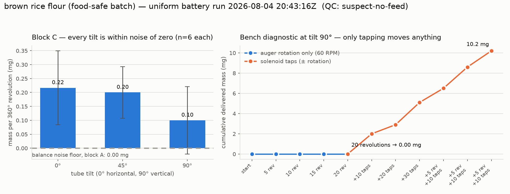

# Battery run — brown rice flour, 2026-08-04

First run of the uniform powder test battery (issue #116) on the bench rig,
driven remotely over Tailscale from a GitHub Actions runner.

> **Amended 2026-08-05** — the `suspect-no-feed` attribution below (a taped
> delivery end) is **withdrawn**: @swcharles confirmed from the bench video
> that the tape was off for this run. The measured zeros stand; the cause
> does not. See
> [2026-08-05-brown-rice-flour-amendment.md](2026-08-05-brown-rice-flour-amendment.md).

| | |
|---|---|
| Run directory | [`data/battery/20260804T204316Z_brown-rice-flour/`](../../data/battery/20260804T204316Z_brown-rice-flour) |
| MongoDB | `powder_doser.battery_runs`, `_id` `6a7251ebc66ed0e4a95e6ab9` |
| Powder | brown rice flour (food-safe batch, `batch: food-safe-2026-08`) |
| Loaded by | @swcharles |
| Blocks run | A, B, C, D, E, G (F skipped — DRV2605L `[Errno 5] EIO`) |
| Wall clock | 20:43:16 → 20:50:21 UTC (7 min; the battery short-circuits when nothing flows) |
| **QC verdict** | **`suspect-no-feed` — not valid for cross-powder comparison** |

## What happened

The battery executed end to end with no software or hardware faults, and the
rig itself checked out before the run: the balance streams stable readings at
0.1 mg resolution, the servo sweeps the mounting plate 0 → 22.5 → 45°, and the
stepper turns exactly as commanded (4.58 auger revolutions in 5.0 s at
55 auger RPM).

What did not happen is powder delivery. Total mass across the whole battery —
64 measured trials at three tilts, five auger speeds, 16 taps, plus ~14 auger
revolutions in the three closed-loop doses — was about **5 mg**.

| Block | Result |
|---|---|
| A baseline | 8 no-actuation reads, all deltas 0.0000 g — noise floor below display resolution |
| B hold | no spontaneous discharge at 0°, 45° or 90° |
| C rotation | 0.22 / 0.20 / 0.10 mg per 360° revolution at 0° / 45° / 90°, RSD 114–297 %, error bars crossing zero |
| D speed | 0.6 mg mean over three revolutions at 15 / 45 / 90 RPM |
| E tap | refeed 0.01–0.28 mg, tap 0.00–0.03 mg per trial |
| F vib | skipped, driver unavailable |
| G dose | 3 × 1.000 g requested; 0.0008 / 0.0000 / 0.0011 g delivered, all `stalled` after ~5 s |

## Why this is a rig fault, not powder behaviour

A follow-up bench diagnostic at tilt 90° (fully vertical), run immediately
afterwards:

- **20 continuous auger revolutions at 60 RPM → 0.0000 g.** Not "a little",
  exactly zero, with the balance still resolving 0.1 mg.
- **30 solenoid taps at the same tilt → 5.1 mg** (~0.17 mg/tap).
- Three further rounds of 5 revolutions + 10 taps → 10.2 mg cumulative, all of
  the gain attributable to the taps.

Rotation contributing literally nothing while tapping shakes out fines is the
signature of a blocked or disengaged delivery path — powder that is already
past the blockage gets vibrated loose, but nothing is being conveyed. Cohesion
would look different: slower than salt, erratic, but responsive to auger
revolutions, which is what the manual tests in issue #116 found for this same
flour.



## Bench checks before re-running

1. **Is the threaded storage cap still on the delivery end?** These are storage
   augers printed with caps (issue #116); a capped outlet reproduces exactly
   this signature.
2. **Is the auger seated in the drive coupler?** The stepper turned as
   commanded, but nothing downstream verifies that the tube turned with it — a
   tube resting in the cradle without engaging the coupler looks identical from
   the firmware's side.
3. **Does powder reach the delivery flights?** A tube filled from the rear with
   an empty delivery section will not feed for many revolutions.
4. **Outlet aimed into the collection dish**, not past its rim.

Then re-run:

```bash
~/powder-doser-venv/bin/python ~/powder-doser/scripts/powder_battery_capture.py \
    --port /dev/ttyACM0 --powder-id brown-rice-flour \
    --powder "brown rice flour (food-safe batch)" --unattended
```

The rig was left safe afterwards: stepper disabled, solenoid off, plate
returned to 0°.

## Open item

The DRV2605L vibration driver still reports `[Errno 5] EIO`, so block F has now
been skipped on this run as it was in the issue #131 sessions. Vibration data
for every powder run before that is fixed will have to be back-filled.
