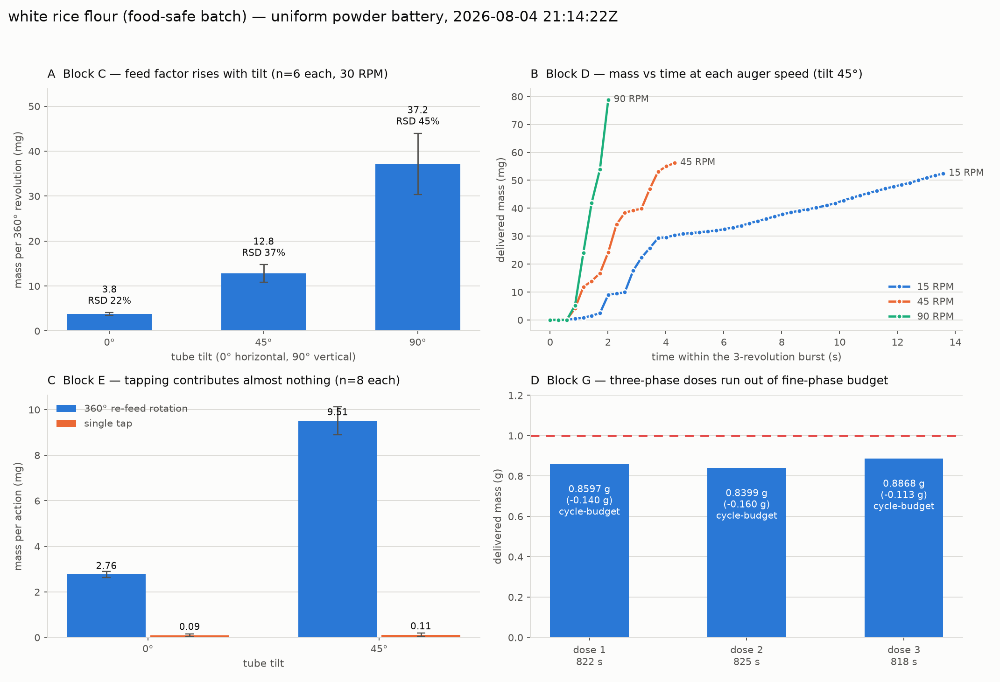

# Battery run — white rice flour, 2026-08-04

Second run of the uniform powder test battery (issue #116), and the **first one
that actually conveyed powder** — the delivery-end tape that produced the
brown-rice-flour no-feed result was removed before this run.

| | |
|---|---|
| Run directory | [`data/battery/20260804T211422Z_white-rice-flour/`](../../data/battery/20260804T211422Z_white-rice-flour) |
| MongoDB | `powder_doser.battery_runs`, `_id` `6a72616576d1d1c6005f7f7f` |
| Powder | white rice flour (food-safe batch, `batch: food-safe-2026-08`) |
| Loaded by | @swcharles |
| Blocks run | A, B, C, D, E, G (F skipped — DRV2605L not attached, `[Errno 5] EIO`) |
| Wall clock | 21:14:22 → 22:02:11 UTC (48 min) |
| **QC verdict** | **`ok` — valid for cross-powder comparison** |

## Pre-flight feed check

Because the previous run's data was indistinguishable from a genuinely cohesive
powder, the same bench diagnostic was run *before* committing to the battery:
tare, tilt 90°, five 360° auger revolutions at 30 RPM.

| | brown rice flour (taped) | white rice flour (tape removed) |
|---|---|---|
| 5 auger revolutions | 0.0000 g | 0.1889 g |
| per revolution | 0 mg | 1.7 / 23.3 / 70.2 / 50.3 / 43.4 mg |
| 10 taps | ~1.7 mg | 23.5 mg |

The first-revolution ramp is the delivery section charging from empty. Feed
confirmed, battery started.

## Results

Zero trials were flagged `lowflow` — every block delivered measurable mass.

### Block A — baseline

Eight no-actuation reads at tilt 45°, all deltas exactly 0.0000 g. The balance
noise floor is below its 0.1 mg display resolution, so every number below is
well clear of it.

### Block B — static hold

15 s hold at 0°, 45° and 90° with no actuation: 0.0000 g at all three. White
rice flour does not avalanche or self-discharge, even fully vertical — it needs
the auger.

### Block C — rotation vs tilt (6 × 360° at 30 RPM per tilt)

| tilt | mass per revolution | RSD |
|---|---|---|
| 0° | 3.75 mg | 22 % |
| 45° | 12.78 mg | 37 % |
| 90° | 37.15 mg | 45 % |

Feed factor is monotonic in tilt and spans a factor of ~10 from horizontal to
vertical — gravity is doing most of the work and the auger is metering it. Note
that the spread grows with the mean: the more the powder flows, the less
repeatable each revolution is.

### Block D — rotation speed (3 revolutions at tilt 45°)

| auger speed | mass per 3 rev | per revolution | mean rate |
|---|---|---|---|
| 15 RPM | 57.2 mg | 19.1 mg | 4.8 mg/s |
| 45 RPM | 72.3 mg | 24.1 mg | 18 mg/s |
| 90 RPM | 111.1 mg | 37.0 mg | 56 mg/s |

Mass per *revolution* nearly doubles from 15 to 90 RPM, so this is not a purely
volumetric screw — faster rotation fluidises the flour and packs the flights
more fully. The 15 RPM trace also shows the clearest stair-stepping (a plateau
around 3.5–7 s), i.e. discrete slugs rather than a continuous stream; that
pulsation is what the manuscript's mass-vs-time panel is meant to show.

The per-revolution numbers at 45° are noticeably higher here (19–37 mg) than in
block C at the same tilt (12.8 mg). Continuous rotation feeds better than
discrete one-revolution steps that stop and settle between trials.

### Block E — tapping (8 trials each at 0° and 45°)

| tilt | 360° re-feed rotation | single tap |
|---|---|---|
| 0° | 2.76 mg | 0.09 mg (RSD 207 %) |
| 45° | 9.51 mg | 0.11 mg (RSD 181 %) |

**Tapping is not a useful actuator for this powder in this rig.** A tap moves
~0.1 mg with a relative spread over 100 %, i.e. it is barely distinguishable
from zero, while the re-feed rotation in the same trial moves 25–90× more. This
contradicts the manual finding in issue #116 that tapping "successfully forces
the flour through" — but the hand tests were vigorous flicks of the whole tube,
whereas this is a single 60 ms solenoid pulse against the mount. The
discrepancy is a real result about the *solenoid*, not about the flour.

### Block F — vibration

Skipped. The vibration motor is not attached and the DRV2605L reports
`[Errno 5] EIO`. Needs back-filling for every powder run so far.

### Block G — closed-loop 1.000 g doses (three-phase controller, frozen salt parameters)

| dose | delivered | error | status | elapsed | phase cycles | taps |
|---|---|---|---|---|---|---|
| 1 | 0.8597 g | −0.140 g | `cycle-budget` | 822 s | bulk 51, fine 200 | 0 |
| 2 | 0.8399 g | −0.160 g | `cycle-budget` | 825 s | bulk 48, fine 200 | 0 |
| 3 | 0.8868 g | −0.113 g | `cycle-budget` | 818 s | bulk 36, fine 200 | 0 |

All three ran out of fine-phase budget rather than converging. The mechanism:

1. Phase 1 *bulk* (continuous, 55 RPM, tilt 90°) halts at its 0.12 g
   anticipation while ~0.62 g still to go — that anticipation was measured on
   salt, and white rice flour's in-flight mass is much smaller, so bulk hands
   over ~0.38 g of work to the fine phase instead of ~0.
2. Phase 2 *fine* (45° increments at 30 RPM, tilt 45°) delivers ~1–4 mg per
   4 s cycle. Closing 0.38 g at that rate needs several hundred cycles; the
   200-cycle ceiling stops it at ~0.85 g.
3. Phase 3 *tap* never runs, because the fine→tap handover is at 0.050 g to go
   and the dose never gets that close. Hence 0 taps — and given block E, the
   tap phase would not have closed the gap anyway.

Consistent and repeatable (−0.113 to −0.160 g across three doses, ~820 s each),
so this is a clean characterisation of the salt-tuned controller applied
unchanged to white rice flour — which is exactly what the uniform battery is
for. It is **not** a measure of achievable accuracy on this powder; that needs
the per-powder tuning that issues #123/#130 will do.

## Implications for the controller (out of scope for this battery, worth recording)

- The 0.12 g bulk anticipation is powder-specific and dominates the outcome.
  Estimating it online (from the observed bulk-phase rate) would fix the
  hand-over point for every powder at once.
- The fine phase at tilt 45° is ~3 mg/cycle for this flour while a bulk
  revolution at tilt 90° is ~37 mg. Fine increments at a higher tilt, or a
  larger increment, would close the gap in a tenth of the cycles.
- A `cycle-budget` exit is currently indistinguishable in the status field from
  a powder that genuinely cannot be dosed. It would help to record the
  remaining-mass trend at exit.

## Rig state

Left safe: stepper disabled, solenoid off, plate returned to 0°. About 3.5 g of
white rice flour was dispensed in total (0.19 g pre-flight, ~0.7 g in blocks
C–E, 2.59 g across the three doses).
