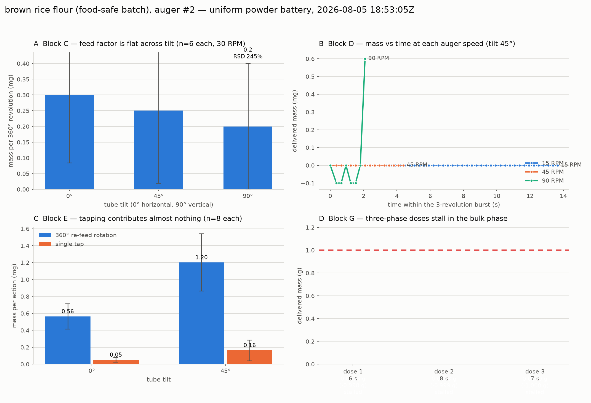
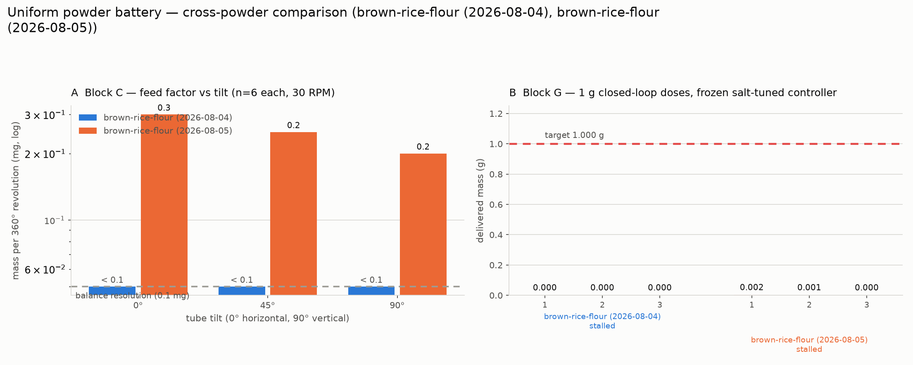

# Battery run — brown rice flour, second auger, 2026-08-05

Fifth run of the uniform powder test battery (issue #116), and the third
attempt at brown rice flour. This one exists to answer a single question
@swcharles raised after the [2026-08-04 re-run](2026-08-04-brown-rice-flour-rerun.md):
*is the near-zero feed factor a property of the powder, or of that particular
printed auger?* The flour was transferred to a **second, independently printed
auger** and the same frozen battery was run against it.

**Answer: the powder.** The second auger conveys 0.20–0.30 mg per revolution
where the first conveyed less than the balance could resolve — a difference
between "almost nothing" and "nothing", against the 10.9 mg/rev of sodium
alginate and 37.2 mg/rev of white rice flour measured on the same rig in the
same 24 hours. Two independent augers and a drive-train-free hand test agree.
This run is therefore the first brown-rice-flour battery marked
`valid_for_cross_powder_comparison = true`.

| | |
|---|---|
| Run directory | [`data/battery/20260805T185305Z_brown-rice-flour/`](../../data/battery/20260805T185305Z_brown-rice-flour) |
| MongoDB | `powder_doser.battery_runs`, `_id` `6a73883ed8b55b145a71406a` |
| Powder | brown rice flour, **auger #2** (`batch: food-safe-2026-08`) |
| Loaded by | @swcharles |
| Blocks run | A, B, C, D, E, G (F skipped — vibration motor not attached) |
| Wall clock | 18:53:05 → 19:00:13 UTC (7 min 07 s), `RUN,END,ok` |
| **QC verdict** | **`conveying-slowly` — valid for cross-powder comparison** |

## Pre-flight, and why it was escalated

The [pre-flight feed check](../powder-battery-protocol.md) returned
`empty-or-blocked`: five 360° revolutions at tilt 90° delivered 0.0000 g, with
10 taps shaking out 0.7 mg. Per protocol that is a stop-and-escalate, not a
stop-and-report, so the
[escalating diagnostic](../../hardware/test-module/firmware/battery_feed_diagnostic.py)
was run before committing to the battery.

| Test (all at tilt 90°) | Rotation | Delivered | Auger #1, 2026-08-04 |
|---|---|---|---|
| Pre-flight, 5 rev @ 30 RPM | 5 rev | 0.0000 g | 0.0000 g |
| 10 rev @ 60 RPM continuous | 10 rev | 0.0024 g | 0.0005 g |
| 10 rev @ 90 RPM continuous | 10 rev | 0.0096 g | 0.0010 g |
| 3 × (20 taps → 5 rev @ 30 RPM) | 15 rev | 0.0028 g rotation, 0.0124 g from taps | 0.0010 g / 0.0045 g |
| **Automated verdict** | | **`conveying-slowly`** | `mechanical-no-feed-marginal` |

The verdict differs from auger #1's, and that difference is the point: rotation
in auger #2 conveys reproducibly (0.24 mg/rev at 60 RPM, 0.96 mg/rev at 90 RPM)
rather than returning zero. `conveying-slowly` is the protocol's "run the
battery" branch, so the battery ran.

## Results

**Block A — baseline.** Eight no-actuation reads, all deltas exactly 0.0000 g.
The balance noise floor is below its 0.1 mg display resolution, so everything
below is limited by resolution, not by drift.

**Block B — static hold.** No spontaneous discharge at 0°, 45° or 90° over
15 s. Brown rice flour does not avalanche even fully vertical.

**Block C — feed factor vs tilt**, six 360° revolutions at 30 RPM per tilt:

| tilt | mg / revolution | RSD | revolutions delivering exactly 0.0000 g |
|---|---|---|---|
| 0° | 0.30 | 176 % | 4 of 6 |
| 45° | 0.25 | 226 % | 4 of 6 |
| 90° | 0.20 | 245 % | 4 of 6 |

Two features matter more than the means:

1. **There is no tilt dependence.** 0.30 → 0.25 → 0.20 mg/rev is flat within a
   spread that is itself >170 % of the mean. Every other powder measured so far
   rises steeply with tilt (white rice flour ~10× from 0° to 90°, sodium
   alginate ~14× from 0° to 45°). A powder whose feed factor ignores gravity
   entirely is one whose cohesive strength dominates at every angle — it never
   fills the flights, so there is nothing for tilt to help.
2. **The mass arrives in isolated slugs.** 13 of the 18 revolutions delivered
   exactly 0.0000 g; the non-zero rows are single 1.2–1.4 mg events. This is not
   a small flow rate, it is an intermittent clump release. Reporting 0.25 mg/rev
   as a rate would misrepresent it, which is why the comparison figure draws
   these values with the balance-resolution reference line.

**Block D — speed sweep** (3 continuous revolutions at tilt 45°): 0.0 mg at
15 RPM, 0.0 mg at 45 RPM, 2.6 mg at 90 RPM. One event at the highest speed,
nothing at the other two — consistent with the diagnostic, where 90 RPM was the
only condition that reliably shifted anything.

**Block E — tapping.** Per tap: 0.05 mg at 0°, 0.16 mg at 45°, RSD 151 % and
213 %. The measured re-feed rotation in the same trials moved 0.56 mg and
1.20 mg. Both are near the resolution floor; neither is a usable actuator here.
This is the fourth consecutive powder where the single 60 ms solenoid pulse
contributes essentially nothing — see the
[white rice flour notes](2026-08-04-white-rice-flour.md) for why that is most
likely a statement about the solenoid rather than about the powders.

**Block G — closed-loop doses.** All three 1.000 g doses exited `stalled` at
0.0018 / 0.0008 / 0.0000 g after 6–8 s and 14–17 bulk cycles, with zero taps.
The three-phase controller's stall detector fired long before the fine or tap
phases were reachable. This is the correct behaviour: with a feed factor ~50×
below sodium alginate's, a 1 g dose would need tens of thousands of
revolutions.

## Auger #1 vs auger #2

| | auger #1 (2026-08-04 22:49) | auger #2 (2026-08-05 18:53) |
|---|---|---|
| Block C, 0° | < 0.1 mg/rev (0.0000 g on all 6) | 0.30 mg/rev |
| Block C, 45° | < 0.1 mg/rev | 0.25 mg/rev |
| Block C, 90° | < 0.1 mg/rev | 0.20 mg/rev |
| Diagnostic, 10 rev @ 90 RPM | 0.10 mg/rev | 0.96 mg/rev |
| Block G | 3 × `stalled` at 0.0000 g | 3 × `stalled` at ≤ 0.0018 g |

Auger #2 is consistently better — roughly 3–10× — and both remain two to three
orders of magnitude below every other powder tested. A print defect that
explained the first result would have to be one that a second print reproduces
to within a factor of ten while the same rig moves white rice flour 190× faster
an hour later. The print-quality hypothesis is not supported.

## QC decision

Recorded as `qc.verdict = "conveying-slowly"` with
`valid_for_cross_powder_comparison = true`, which supersedes the two
2026-08-04 runs (both still `false`). The promotion rests on every rig-side
explanation having been eliminated rather than merely doubted:

| Candidate fault | Status |
|---|---|
| Delivery-end tape | Eliminated — @swcharles confirmed from the stream video that it was off |
| Drive coupler slipping | Eliminated — operator confirms the tube rotates with the coupler in all trials |
| First auger printed badly | Eliminated — a second independent print reproduces the result |
| Empty delivery flights | Eliminated — the escalated diagnostic conveys, so powder reaches the flights |
| Blocked outlet | Eliminated — same, plus taps shake material out |
| Balance/drift | Eliminated — block A deltas are exactly 0.0000 g |

The corroborating hand test (@swcharles, 20 rotations of auger #1 over a zeroed
balance, 0.0019 g total = 0.095 mg/rev, with no coupler and no cap in the path)
sits within an order of magnitude of both rig measurements.

## For the manuscript

Brown rice flour is now a legitimate data point rather than a suspected
failure, and a useful one: it is the **lower bound** of the dataset, the powder
this auger geometry cannot convey. Stated carefully, the result is

> mass per 360° auger revolution ≤ 0.3 mg at every tilt, with 72 % of
> revolutions delivering less than the 0.1 mg balance resolution — i.e. no
> measurable conveyance, versus 37.2 mg/rev for white rice flour under
> identical conditions.

@carl-robison's manual finding that this flour needs "a completely redesigned,
wider-bore column" is the standing recommendation, and this is the quantitative
version of it. A wider-bore auger for brown rice flour would be the natural
follow-up experiment and would turn this into a geometry-comparison result.

## Rig state

The battery's teardown disabled the stepper, released the solenoid, and — new
in this run — **returned the tilt to 0°**, recorded as `META,park_tilt_deg,0.0`
in the [raw serial log](../../data/battery/20260805T185305Z_brown-rice-flour/raw_serial_brown-rice-flour.log)
immediately before `RUN,END,ok`. See the
[protocol doc](../powder-battery-protocol.md) for the parking behaviour.
