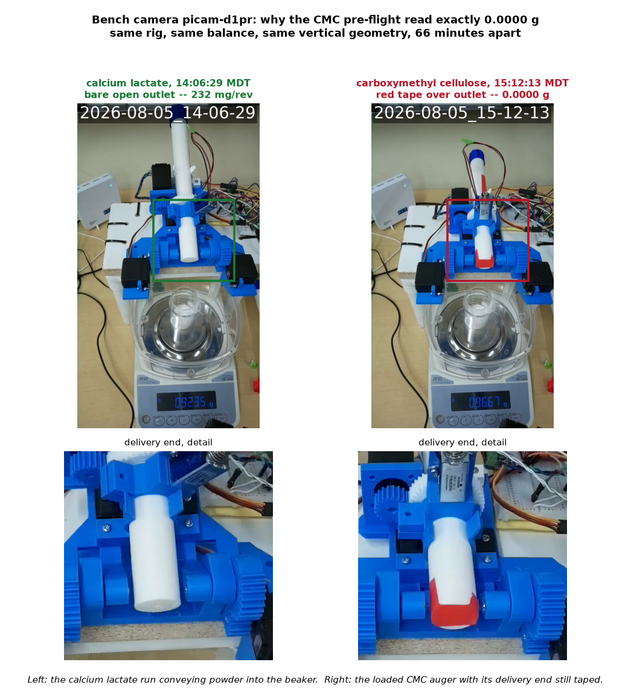

# Carboxymethyl cellulose — battery not run, delivery end taped (2026-08-05)

Issue #116. **No battery was run and no `battery_runs` document was
created.** The pre-flight feed check read exactly 0.0000 g, the escalated
diagnostic agreed, and a frame from the bench camera shows why: the
loaded auger still has red tape folded over its delivery end.

All times below are **MDT** (the lab clock, UTC−6), with UTC alongside
because the run documents, directory stamps and stream anchors store UTC.

## What was run

| Step | MDT | UTC | Result |
|---|---|---|---|
| Pre-flight feed check | 15:12:16 → 15:13:01 | 21:12:16 → 21:13:01 | `empty-or-blocked` |
| Escalated feed diagnostic | 15:13:14 → 15:15:18 | 21:13:14 → 21:15:18 | `empty-or-fully-blocked` |
| Bench camera frames | 15:12:13, 14:06:29 | 21:12:13, 20:06:29 | outlet taped vs outlet open |

Pre-flight (tilt 90°, five 360° revolutions at 30 RPM, then 10 taps):

```
PRE,rev,0..4   0.0000 g each
PRE,tap,10     0.0000 g
PRE,END,empty-or-blocked,0.0000,0.0000
```

Escalation ([`battery_feed_diagnostic.py`](../../hardware/test-module/firmware/battery_feed_diagnostic.py),
tilt 90°): 10 rev @ 60 RPM, 10 rev @ 90 RPM, then three rounds of
20 taps + 5 rev. **25 revolutions and 60 taps, every single reading
exactly 0.0000 g.**

That total silence is what separates this from every previous run. Even
the brown rice flour that this rig genuinely cannot convey produced
5.1 mg from 30 taps on 2026-08-04 and 1.5 mg over 60 revolutions on the
2026-08-05 re-run — cohesive powder still lets *fines* shake through.
Exactly zero through 60 taps means nothing is reaching the beaker at all.

## The camera settles it



Two frames from the `picam-d1pr` broadcast
([`_iDB8z83GdQ`](https://youtu.be/_iDB8z83GdQ)), same rig, same balance,
same vertical geometry, 66 minutes apart:

- **15:12:13 MDT**, three seconds before the pre-flight tared: the loaded
  CMC auger at tilt 90° with **red tape folded across the delivery end**,
  directly above the beaker.
  ([full frame](frames/2026-08-05T2112Z_cmc-preflight-outlet-taped.png))
- **14:06:29 MDT**, mid calcium-lactate run: identical geometry, **bare
  open outlet**, balance climbing through 0.9235 g at 232 mg/rev.
  ([full frame](frames/2026-08-05T2006Z_calcium-lactate-outlet-open.png))

The balance is fine — it is displaying and it responded normally 66
minutes earlier. The stepper, servo and solenoid all ran without fault.
The powder simply has nowhere to go.

A second detail worth matching before the re-run: the CMC auger also has
its **blue threaded storage cap fitted on the upper (fill) end**, which
the calcium lactate auger did not. The outlet tape is the blocker, but a
sealed fill end can also impede flow by preventing air ingress, and it is
a difference from the runs this one will be compared against.

## What to do

1. Remove the red tape from the **delivery** end.
2. Remove the blue storage cap from the **fill** end, to match the augers
   used for the four valid runs.
3. Comment on #116 and the battery runs — deploy is already in sync, so
   it is just the command.

## Why no data was recorded

There is no `carboxymethyl-cellulose` document in
`powder_doser.battery_runs`; the collection still holds six runs, four of
them valid. The pre-flight and diagnostic output is kept in
[`data/battery/20260805T211216Z_carboxymethyl-cellulose_preflight/`](../../data/battery/20260805T211216Z_carboxymethyl-cellulose_preflight)
as the record of the aborted attempt.

This is the pre-flight gate doing its job. The 2026-08-04 brown-rice-flour
run spent 7 minutes and a full run document on this same fault before the
gate existed, and cost two follow-up sessions to disentangle. Here it cost
three minutes of bench time and no contaminated data.

## Follow-up

New helper [`scripts/bench_frame.py`](../../scripts/bench_frame.py) makes
the camera step reproducible instead of ad-hoc — it is now the standard
response to a flat-zero pre-flight. See
[the protocol doc](../powder-battery-protocol.md).
