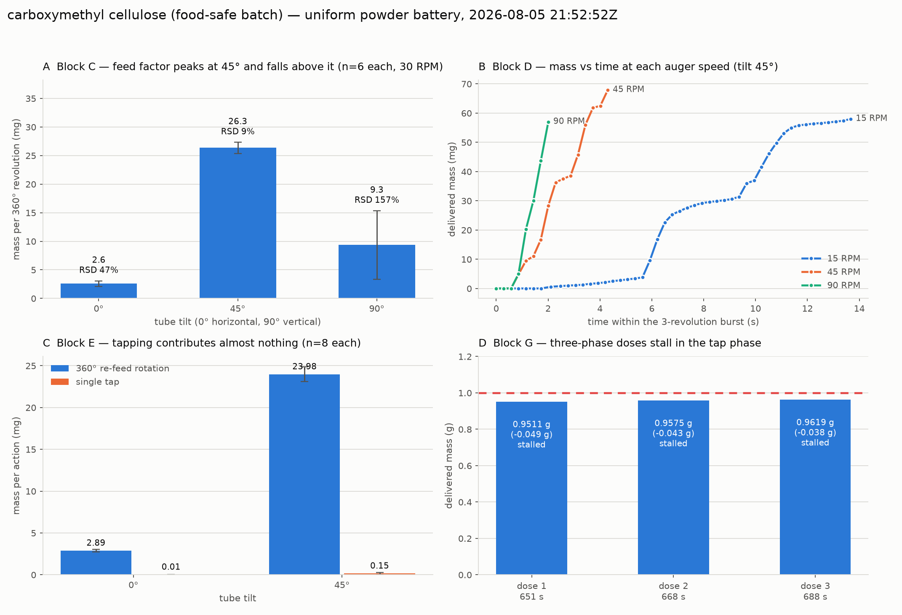
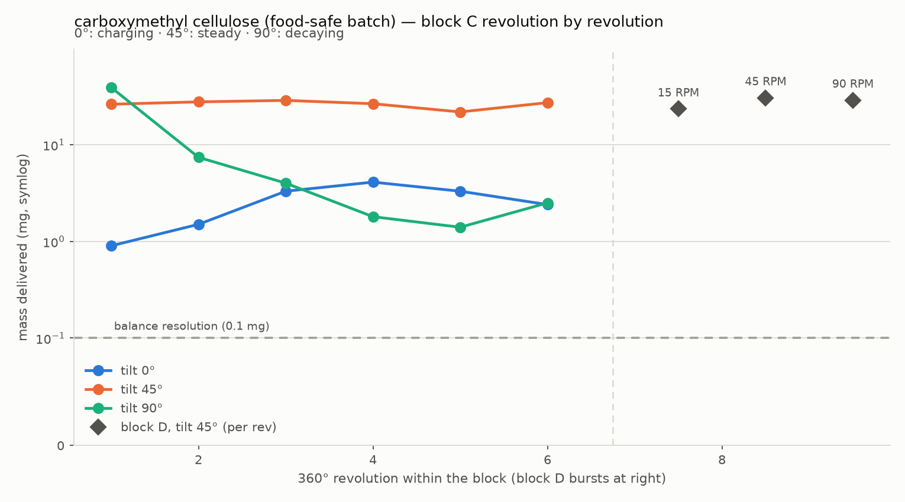
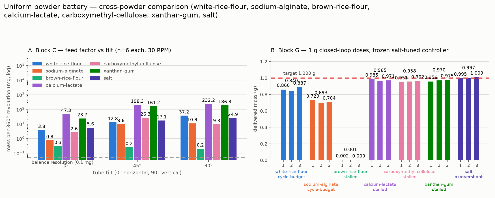

# Carboxymethyl cellulose — uniform powder battery, 2026-08-05

Fifth valid-feed run of the issue #116 battery, and the first powder
whose feed factor is **not monotonic in tilt**: it peaks at 45° and
falls by nearly 3× at 90°.

| | |
|---|---|
| Powder | carboxymethyl cellulose (food-safe batch) |
| Auger | threaded storage auger, `batch: food-safe-2026-08` |
| Loaded by | @swcharles |
| Pre-flight | 15:49:24 MDT / 21:49:24 UTC |
| Diagnostic | 15:50:31 → 15:52:36 MDT |
| **Battery** | **15:52:52 → 16:33:04 MDT** (21:52:52 → 22:33:04 UTC) |
| Elapsed | 0:40:12 |
| Device status | `RUN,END,ok`, tilt parked at 0° |
| Blocks | A–E + G; F skipped (vibration motor not attached) |
| MongoDB | `powder_doser.battery_runs`, `_id` `6a73ba214a50c12a43e4fd76` |
| QC | `valid_for_cross_powder_comparison = true`, `verdict = "ok"` |

Per-block durations: A 22 s · B 1 m 01 s · C 2 m 11 s · D 32 s ·
E 2 m 32 s · F 0 s · **G 33 m 28 s**.

## This is the second attempt

The [2026-08-05 21:12Z attempt](2026-08-05-carboxymethyl-cellulose-aborted.md)
was aborted before the battery because the delivery end was still taped:
exactly 0.0000 g through 25 auger revolutions and 60 taps, confirmed
against a bench-camera frame. @swcharles removed the tape, and this run
is the re-check.

## The pre-flight nearly condemned a powder that conveys fine

With the tape off, the standard 5-revolution pre-flight returned
**`suspect-no-feed`**: 0.0018 g over 5 revolutions, i.e. 0.36 mg/rev —
brown-rice-flour territory. The one thing separating it from the taped
attempt was that it was **not exactly zero**.

Escalating to `battery_feed_diagnostic.py` showed why:

| step | delta | mg / revolution |
|---|---|---|
| 10 rev @ 60 RPM | 0.0114 g | 1.14 |
| 10 rev @ 90 RPM | 0.0136 g | 1.36 |
| 20 taps | 0.0034 g | — |
| 5 rev @ 30 RPM | 0.0171 g | 3.42 |
| 20 taps | 0.0078 g | — |
| 5 rev @ 30 RPM | 0.0360 g | 7.20 |
| 20 taps | 0.0113 g | — |
| 5 rev @ 30 RPM | 0.1141 g | **22.82** |

Monotonic, **20× over 35 revolutions** — the delivery section charging
from empty, not a restricted path. Block C then measured 26.3 mg/rev at
tilt 45°, so the pre-flight under-reported the steady-state feed factor
by **73×**.

White rice flour charged in ~3 revolutions, so five was enough for it.
Carboxymethyl cellulose needs ~30. **A `suspect-no-feed` pre-flight is
not grounds to stop** — see the protocol change below.

## Results

**Block A** — 8 no-actuation reads, all exactly 0.0000 g. Noise floor
below the balance's 0.1 mg display resolution.

**Block B** — no discharge at 0°, 45° or 90° over 15 s. Like every
powder measured so far including calcium lactate, it does not avalanche
through a stationary auger even fully vertical.

### Block C — the feed factor peaks at 45°

Six 360° revolutions at 30 RPM at each tilt:

| tilt | mg / revolution | RSD |
|---|---|---|
| 0° | 2.63 | 47 % |
| 45° | **26.32** | **9.1 %** |
| 90° | 9.35 | 157 % |

Every other powder so far rises with tilt or saturates. This one **falls
by 2.8× from 45° to 90°**, and the 157 % RSD at 90° says the mean is not
describing a stable process.

### The 90° mean describes no revolution that actually happened

Revolution by revolution at 90°: **39.0, 7.4, 4.0, 1.8, 1.4, 2.5 mg**.
The first revolution discharges what was already in the flights, and
then feed collapses to ~2 mg/rev and stays there. At 45° the same six
revolutions are flat (26.2 / 27.7 / 28.7 / 26.5 / 21.8 / 27.2 mg).

**It is the tilt, not a depleted hopper.** Block D runs at tilt 45°
immediately after block C ends at 90°, and feed comes straight back to
23–31 mg/rev; block E's 8 re-feed rotations at 45° then hold 23.98 mg/rev
at 10.5 % RSD for another 2.5 minutes. Plenty of powder, conveyed
normally, the moment the tube leaves vertical.

The mechanism this points at is **arching over the auger intake**: a
cohesive powder in a vertical column bridges above the flights, so they
stop refilling; tilting to 45° lets material slump sideways into them.
That is consistent with block B (no gravity discharge at any tilt) and
with the slow charging seen in the diagnostic.

For the manuscript this is the counterexample to "more tilt is more
flow" — a real operating-point result, since 45° here is both the
fastest **and** by far the most repeatable setting.

### Block D — speed

Three continuous revolutions at tilt 45°:

| auger RPM | mg / 3 rev | mg / revolution |
|---|---|---|
| 15 | 70.2 | 23.4 |
| 45 | 91.6 | 30.5 |
| 90 | 86.5 | 28.8 |

**+23 % per revolution over a 6× speed change**, which places it with
sodium alginate (+17 %) rather than white rice flour (+94 %) or calcium
lactate (−33 %). Mass per turn is close to geometric, so RPM is a
reasonably clean throughput knob here. Panel B shows the 15 RPM trace
delivering in two distinct slugs rather than a stream.

### Block E — tapping does nothing, again

| tilt | 360° re-feed rotation | single tap |
|---|---|---|
| 0° | 2.89 mg | 0.01 mg (RSD 283 %) |
| 45° | 23.98 mg | 0.15 mg (RSD 205 %) |

Fifth powder, fourth time the solenoid is indistinguishable from zero.
Calcium lactate remains the only powder it moves (20.36 mg/tap at 45°),
which is why "tap efficacy is a powder property" rather than purely a
hardware limitation — but for CMC the hardware limit is what bites.

This **contradicts** @carl-robison's manual finding that tapping CMC
"yields an immediate and highly beneficial response, consistently
releasing large, dense bursts of powder". As with the flours and
alginate, the hand tests were vigorous flicks of the whole tube; this is
a single 60 ms solenoid pulse against the mount. Both observations are
real and they are about different actuators.

### Block G — three 1 g doses, frozen salt-tuned controller

| dose | delivered | error | status | time | cycles | taps |
|---|---|---|---|---|---|---|
| 1 | 0.9511 g | −48.9 mg | `stalled` | 651 s | bulk 53, fine 135, tap 33 | 66 |
| 2 | 0.9575 g | −42.5 mg | `stalled` | 668 s | bulk 51, fine 136, tap 39 | 78 |
| 3 | 0.9619 g | −38.1 mg | `stalled` | 688 s | bulk 56, fine 137, tap 46 | 92 |

Mean error **−43.2 mg** — second best of the five powders, behind
calcium lactate (−26.5 mg) and well ahead of white rice flour
(−138 mg) and sodium alginate (−292 mg).

Only the second powder to **reach phase 3** at all, and it fails the
same way calcium lactate does rather than the way the flours do:

1. Bulk and fine get to ~50 mg-to-go without exhausting the 200-cycle
   fine budget (135–137 cycles used).
2. Phase 3 taps at **tilt 0°**, where block E measured 0.01 mg/tap.
   Nothing closes at that rate.
3. The 5° nudge budget (max 10) is spent, then the no-flow stall
   detector fires.

So the residual is essentially the fine→tap handover threshold (50 mg)
minus whatever the nudges recover, which is why all three land in a
38–49 mg band. The errors also **improve monotonically** across the
three doses (−48.9 → −42.5 → −38.1 mg) as the tap count rises
(66 → 78 → 92), consistent with the lip progressively re-charging
between doses.

Implications for #123/#130, on top of the calcium lactate ones:

- **Phase 3 should not tap at tilt 0° for cohesive powders.** Block E
  measures 0.01 mg/tap at 0° against 0.15 at 45°; for this powder the
  correct phase-3 action is a small rotation at 45°, not a tap at 0°.
- **The fine→tap handover threshold should scale with what phase 3 can
  actually deliver.** Handing 50 mg to an actuator that moves 0.01 mg
  per action guarantees a stall. If tap rate × budget < the threshold,
  phase 3 should be skipped and fine should run to tolerance.
- **`stalled` after reaching phase 3 is a different failure from
  `stalled` in bulk** (brown rice flour) and from `cycle-budget` (the
  flours). The status alone does not distinguish them; the phase-cycle
  breakdown does, and it should be surfaced.

## Cross-powder picture

| Powder | mg/rev @ 45° | mg/rev @ 90° | best RSD | mg/tap @ 45° | mean dose error |
|---|---|---|---|---|---|
| Calcium lactate | 198.3 | 232.2 | 2.2 % | 20.36 | −26.5 mg |
| White rice flour | 12.8 | 37.2 | 22 % | 0.11 | −138 mg |
| **Carboxymethyl cellulose** | **26.3** | **9.3** | **9.1 %** | 0.15 | **−43.2 mg** |
| Sodium alginate | 9.6 | 10.9 | 8 % | 0.24 | −292 mg |
| Brown rice flour (auger #2) | 0.25 | 0.20 | — | 0.16 | stalled |

Note that dose error does **not** track feed factor: sodium alginate
conveys less than CMC per revolution yet does 7× worse on a 1 g dose,
because the frozen bulk anticipation (0.12 g, measured on salt) is what
sets how much work lands in the fine phase. That is the argument #97
needs for per-powder parameters.

## Protocol change

The pre-flight's `suspect-no-feed` verdict was a **false negative** here
— it would have cost a powder that conveys at 26 mg/rev. The rule is now:

- **Exactly 0.0000 g** through the pre-flight → a blocked path (tape,
  cap) is likely; grab a camera frame before spending a battery.
- **Non-zero but low** → always escalate to
  `battery_feed_diagnostic.py`. A slow-charging cohesive powder is
  indistinguishable from a restricted path over five revolutions, and
  the diagnostic's 35 revolutions is what tells them apart.

## Artifacts

`data/battery/20260805T215252Z_carboxymethyl-cellulose/` — `trials`,
`polls`, `doses`, `summary`, `timeline` CSVs, `run_*.json`,
`raw_serial_*.log`, and the two figures. Also on the Pi at
`~/powder-doser/data/battery/20260805T215252Z_carboxymethyl-cellulose/`.

Standing gap: **block F (vibration) is missing from all five runs** and
needs back-filling once the DRV2605L / motor is attached.
