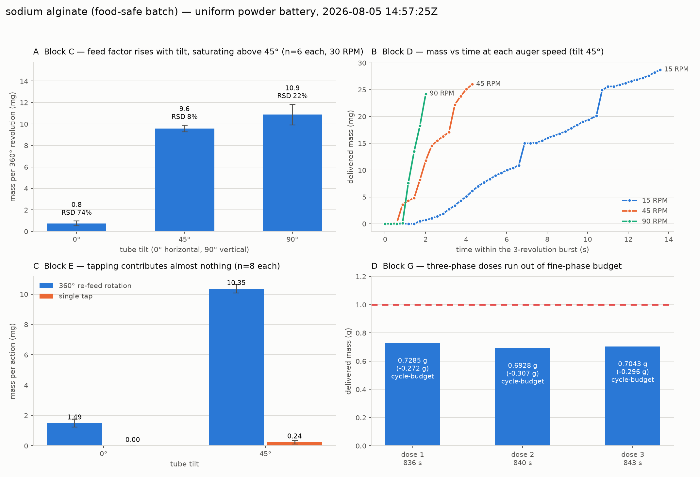

# Battery run — sodium alginate, 2026-08-05

Third valid-feed run of the uniform powder test battery (issue #116), and the
most *repeatable* powder measured so far: block C relative standard deviation
drops to 8 % at tilt 45°, against 37 % for white rice flour at the same tilt.

| | |
|---|---|
| Run directory | [`data/battery/20260805T145725Z_sodium-alginate/`](../../data/battery/20260805T145725Z_sodium-alginate) |
| MongoDB | `powder_doser.battery_runs`, `_id` `6a735ac28614fc51f1325347` |
| Powder | sodium alginate (food-safe batch, `batch: food-safe-2026-08`) |
| Loaded by | @swcharles |
| Blocks run | A, B, C, D, E, G (F skipped — vibration motor not attached) |
| Wall clock | 14:57:25 → 15:46:08 UTC (**48 min 43 s**) |
| **QC verdict** | **`ok` — valid for cross-powder comparison** |

## Where the time went

The run was reported as "stuck on block C for over an hour". It was not: block C
ran for **119 seconds**. The wall-clock account below is reconstructed from the
device `t_ms` column plus `started_utc`, and is the reason
`powder_battery_capture.py` now records a `block_timeline` natively.

| Block | Starts (UTC) | Duration |
|---|---|---|
| A baseline | 14:57:32 | 15 s |
| B hold | 14:58:07 | 41 s |
| C rotation | 14:59:01 | **119 s** |
| D speed | 15:01:22 | 11 s |
| E tap | 15:01:45 | 141 s |
| F vib | — | skipped |
| G dose 1 | 15:04:07 | 836 s |
| G dose 2 | 15:18:03 | 840 s |
| G dose 3 | 15:32:03 | 843 s |

Blocks A–F are 7 minutes of the run. **Block G is the other 42.** Each dose
exhausts the 200-cycle fine-phase budget at ~4 s per cycle, so ~14 min per dose
is the *expected* duration whenever the salt-tuned bulk anticipation overshoots
its handover — not a stall. Any future "is it stuck?" question should be
answered against this table, not against the last block someone saw scroll past.

## Pre-flight feed check

Tare, tilt 90°, five 360° revolutions at 30 RPM, then 10 taps:

| | value |
|---|---|
| 5 auger revolutions | 0.0176 g |
| per revolution | 8.1 / 5.2 / 0.6 / 2.4 / 1.3 mg |
| 10 taps | 4.6 mg |
| Verdict | `feed confirmed` |

Mass rose on every revolution, so the battery was started.

## Results

3 of 64 trials flagged `lowflow`, all of them in block C at tilt 0° — which is
the measurement, not a fault.

### Block A — baseline

Eight no-actuation reads at tilt 45°, all deltas exactly 0.0000 g.

### Block B — static hold

15 s hold at 0°, 45°, 90° with no actuation: 0.0000 g at all three. Sodium
alginate does not self-discharge, even fully vertical.

### Block C — rotation vs tilt (6 × 360° at 30 RPM per tilt)

| Tilt | mg / revolution | RSD |
|---|---|---|
| 0° | 0.75 | 74 % |
| 45° | 9.58 | **8 %** |
| 90° | 10.87 | 22 % |

Two things separate alginate from both flours. First, the feed factor
**saturates** between 45° and 90° (9.6 → 10.9 mg/rev, +13 %) where white rice
flour nearly triples over the same interval (12.8 → 37.2 mg/rev). Second, the
spread at 45° is the tightest yet measured — 8 % RSD, against 37 % for white
rice flour. Alginate is the closest thing in the dataset to a well-behaved
volumetric screw feed, and 45° buys almost all of the flow available at 90°
while keeping the tighter distribution.

Tilt 0° is effectively off: 0.75 mg/rev at 74 % RSD, an order of magnitude below
45°.

### Block D — auger speed (3 continuous revolutions at tilt 45°)

| Auger RPM | mg / 3 rev | mg / revolution |
|---|---|---|
| 15 | 33.2 | 11.1 |
| 45 | 34.8 | 11.6 |
| 90 | 38.9 | 13.0 |

Mass per revolution is nearly flat — **+17 % over a 6× speed increase**. White
rice flour on the same test nearly *doubled* (19.1 → 37.0 mg/rev). So alginate's
delivery is dominated by geometry rather than by speed-dependent fluidisation,
which is the practical reason its repeatability is so much better: flow rate can
be set by RPM without changing the mass metered per turn.

Panel B shows the traces are smooth rather than stair-stepped, i.e. no discrete
slugging at any of the three speeds.

### Block E — tapping (8 single taps per tilt, each with a measured re-feed)

| Tilt | 360° re-feed rotation | single tap |
|---|---|---|
| 0° | 1.49 mg | **0.00 mg** |
| 45° | 10.35 mg | 0.24 mg (RSD 135 %) |

The solenoid contributes nothing usable: exactly zero at 0°, and 0.24 mg at 45°
with a relative spread above 100 %. This is the third powder in a row where the
single 60 ms solenoid pulse fails to act as a fine-dose quantum, and it
contradicts @carl-robison's manual observation that alginate is "highly
responsive to dynamic agitation" — as with white rice flour, the hand test was a
vigorous flick of the whole tube, this is one pulse against the mount. The
finding is about the actuator, not the powder.

### Block F — vibration

Skipped; the DRV2605L motor is not attached. Still missing for every powder.

### Block G — 3 × 1.000 g closed-loop doses, frozen salt-tuned controller

| Dose | Delivered | Error | Status | Time | Cycles | Taps |
|---|---|---|---|---|---|---|
| 1 | 0.7285 g | −0.272 g | `cycle-budget` | 836 s | bulk 103, fine 200 | 0 |
| 2 | 0.6928 g | −0.307 g | `cycle-budget` | 840 s | bulk 113, fine 200 | 0 |
| 3 | 0.7043 g | −0.296 g | `cycle-budget` | 843 s | bulk 114, fine 200 | 0 |

Same failure mode as white rice flour, one step worse. The bulk phase halts at
its salt-derived 0.12 g anticipation with far more than 0.12 g still to go, and
hands ~0.4 g to a fine phase that moves ~1.5 mg per 4 s cycle; 200 cycles closes
~0.31 g of it. Phase 3 (tap) never runs, because the 0.050 g handover is never
reached — and per block E it would not have helped.

Note this is *worse* than white rice flour (−0.29 g vs −0.14 g mean error)
despite alginate being the more repeatable powder. That is the point of the
frozen-controller design: the deficit tracks how far a powder's feed factor sits
from salt's, not how well-behaved it is. Per-powder tuning is #123/#130.

The three errors agree to ±0.018 g, so the controller's failure is itself highly
reproducible on this powder.

## Cross-powder position

Feed factor at tilt 90°, mg per 360° revolution:

| Powder | mg/rev | RSD at 45° |
|---|---|---|
| White rice flour | 37.15 | 37 % |
| **Sodium alginate** | **10.87** | **8 %** |
| Brown rice flour | < 0.1 (below balance resolution) | — |

Alginate sits between the two flours in throughput and ahead of both in
repeatability, which matches @carl-robison's manual ranking (slower than salt,
faster than the flours) while contradicting the manual finding on tapping.

## Provenance note

The capture completed normally and uploaded to MongoDB at 15:46 UTC, but the
GitHub Actions job that launched it ended at 16:17 UTC without committing the
artifacts or reporting. The artifacts in this directory were recovered from the
Pi at `~/powder-doser/data/battery/20260805T145725Z_sodium-alginate/` and
verified byte-identical to the uploaded document; no measured value was
regenerated or edited.
