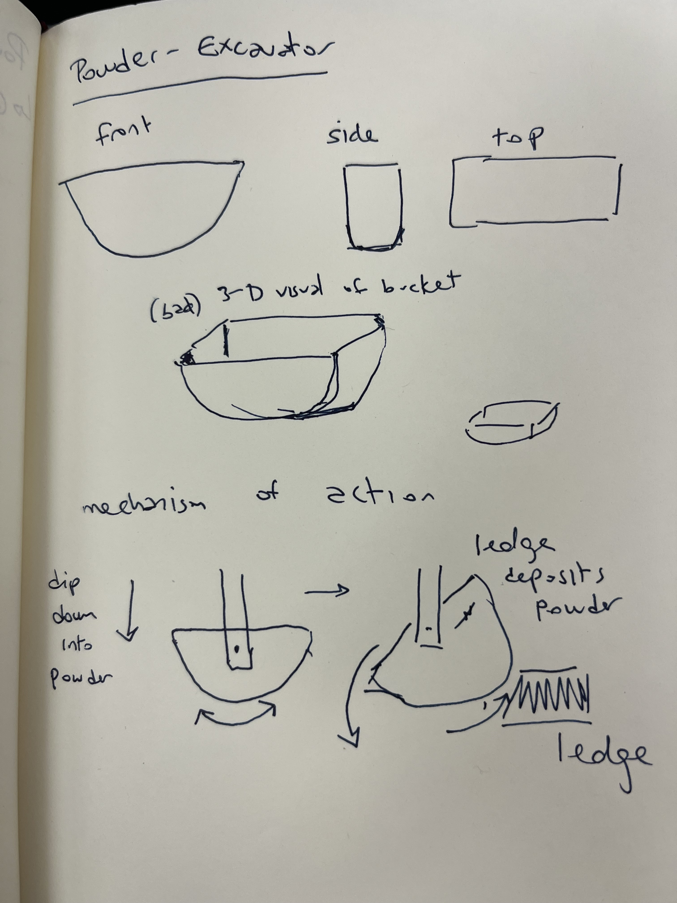
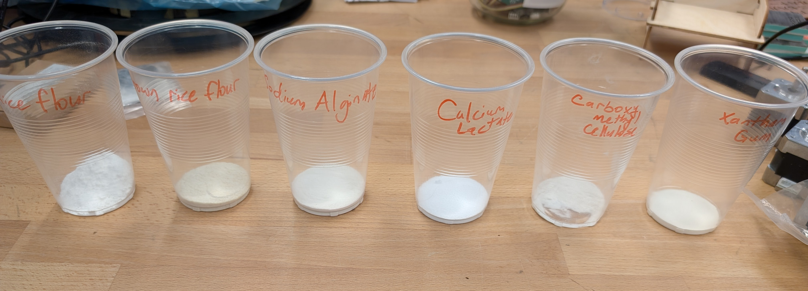
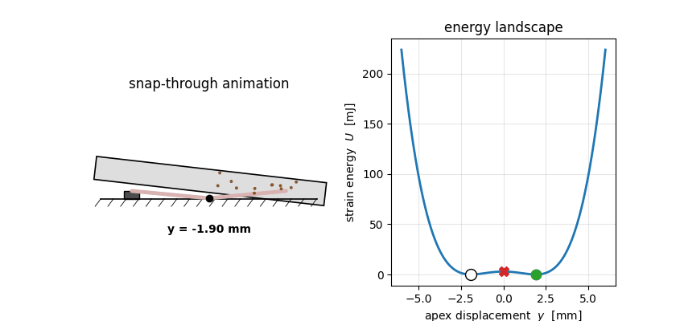
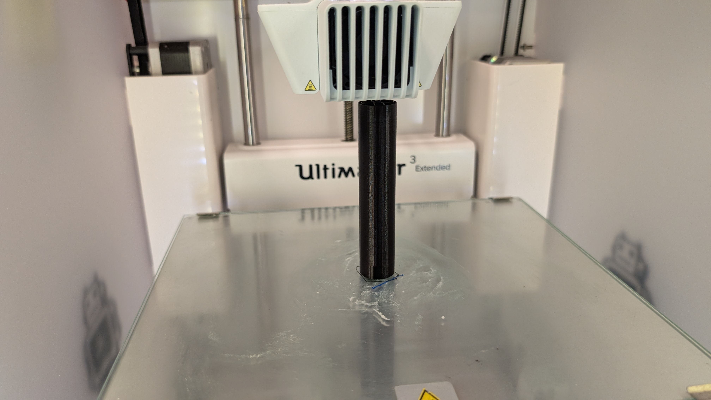

<!-- _class: title -->
<!-- _paginate: false -->

# We built a sub-milligram powder dispenser by treating a coding agent like a junior engineer.

**powder-excavator** — project wrap-up

vertical-cloud-lab · April 2026

---

# The problem: dispensing micron powders at mg–μg precision is dominated by surface forces, not gravity.

- Target dose range: **micrograms to milligrams**
- Substrate: micron-sized solid powders (rice flour, CMC, sodium alginate, …)
- Hardware budget: a Genmitsu 3018-PROVer V2 gantry + a 3D printer
- Time budget: **one workshop week**

> Micron powders are dominated by surface forces (electrostatic, van der Waals), not gravity.
> A 3D-printed scoop will retain powder on its walls after dumping.
> — issue #3, technical-viability writeup

---

# We started with a hand-drawn scoop sketch and a "just put it on the gantry" plan.

<!-- _class: image-only -->

Issue #1 — *"a pure mechanical approach that can be connected to a gantry system"*

---

# Real powders behaved like none of the textbook assumptions.

<!-- _class: image-only -->

Issue #15 — six candidate powders (rice flour, brown rice flour, sodium alginate, calcium lactate, CMC, xanthan gum) tested by hand; bridging, channeling, and electrostatic clinging confirmed in seconds.

---

# Before CAD tools: the agent rejected real CAD options on a single criterion.

### PR #2 — early verdict

> chosen over Rhino/Grasshopper, Fusion Generative Design, nTop, Onshape FeatureScript because it's pure-Python and pip-installable — none of the others survive the "freshly-cloned repo on a CI runner" test

One-line dismissal. No install attempt. No Edison query. No scoreboard.

### Issue #6 — pushback

> You have a full dev environment. You should try to install each of these and if you really can't do anything meaningful within a 60-minute session, that's one thing — but show me.

The fix wasn't a smarter model. It was **explicit instructions to actually try the tools.**

---

# After CAD tools: the agent installed each option, scored them, and changed its own recommendation.

### PR #7 — evidence-based scoreboard

- **CadQuery** + **build123d** (pure-Python, OCP/OpenCascade kernel) → primary
- **OpenSCAD** / **Grasshopper** → alternates
- **Fusion Generative Design** → genuinely doesn't fit CI
- **rhino3dm** → read/write `.3dm` only, no STEP

Verdict per tool, with install logs and one-line export examples.

### Concrete deliverables added

- STEP export as a one-liner (`cq.exporters.export(..., ".step")`)
- 3MF preferred over STL for the Cura path
- PrusaSlicer **and** CuraEngine CLI both wired in
- Onshape REST translation path documented for when API access lands

---

# Along the way we prototyped a bistable snap-through trough as a sibling concept.

<!-- _class: image-only -->

PR #5 — parametric OpenSCAD + FEA cross-check, peak snap **2.36 N**, wells at **±1.9 mm**, 24 tests passing.

---

# When that didn't fit the workshop budget, we generated eight alternative dosing concepts in one panel.

<!-- _class: image-only -->

PR #13 — sieve cup, Pez strip, capillary dip, brush pickup, salt-shaker, passive auger, ERM-augmented sieve, solenoid-tap. Edison promoted the ERM-augmented sieve above the gantry-tap on published vibratory-sieve evidence (Besenhard 2015).

---

# Edison Scientific turned a 60-minute session into a 60-citation literature synthesis.

- **PR #2 → Edison PaperQA3** (high-effort): introduction-grade powder-handling synthesis
- **PR #7 → Edison task `c0f412d3…`**: ~72 KB / 60+ citations independent corroboration of the CAD-tool scoreboard
- Edison surfaced things the agent had missed:
  1. **build123d** as a sibling to CadQuery (same Apache-2.0 OCP kernel)
  2. **Will It Print** (Budinoff 2021) — five validated AM-DFM checks, better than our `dfm.py`
  3. **Jubilee + balance + OpenCV + Ax/BoTorch** as the canonical open-hardware closed-loop rig
- PR #14 documented the Edison `data_entry` upload flow so design files, code, and figures could be sent for review.

---

# The design pivoted from "scoop with a pivot pin" to a vertical Archimedes auger with a sieve.

### Why we pivoted (issue #1, final comment)

> moving towards a vertical auger / Archimedes screw - based system with a sieve at the end, possibly a solenoid for tapping and a small disc vibration motor, along with grounded copper tape

### What the auger gives us

- Dose ≈ rotations × pitch (mass-flow control, not volume-fill)
- Sieve at the exit decouples **flow** from **release**
- Tap solenoid + ERM motor break electrostatic clinging
- Two parts: **fixed shaft** + **rotating outer tube**

---

# The final part is a closed-tube auger printed on the Ultimaker 3 Extended.

<!-- _class: image-only -->

PR #16 — `cad/auger/archimedes-auger.{stl,stp}`, sliced for both Ultimaker (Cura/CuraEngine) and Ender‑3 (PrusaSlicer + CuraEngine), short-named `AUGER.gcode` for the stock Ender LCD.

---

# Watch the auger come off the bed.

<!-- _class: image-only -->

<video src="assets/final-print-video.mp4" poster="assets/final-print-on-ultimaker.jpg" controls autoplay muted loop playsinline style="max-height:70vh; display:block; margin:0 auto;"></video>

PR #16 — first successful print on the Ultimaker 3 Extended. *(In the HTML build the MP4 plays inline; the next slide carries the same motion as a GIF for the PDF.)*

---

# Same moment, GIF version — included so the PDF carries the same signal as the HTML.

<!-- _class: image-only -->

PR #16 — auger coming off the Ultimaker 3 Extended bed.

---

# The "before/after" lesson generalizes: the agent gets dramatically better when you tell it to *try*, not just *recommend*.

| Before instruction | After instruction |
|---|---|
| "Pure-Python only, none of the others survive CI." | Installed each tool, kept logs, scored them. |
| "I can't reach Edison from the sandbox." | Edison API key + endpoint added to `copilot-instructions.md`; queries fired async; results fetched next session. |
| "STL only." | STL **and** STEP **and** 3MF, plus PrusaSlicer **and** CuraEngine g-code per printer. |
| "It looks like a plain cylinder." | Half-cutaway render published so reviewers can see the helix. |

The unlock was process, not capability.

---

# Three things we'd do differently next time.

1. **Give the agent CAD + slicer tools on day one** — not after a PR's worth of pushback.
2. **Treat Edison as a peer reviewer from the start** — fire the literature query before writing the design doc, not after.
3. **Always export the BREP (STEP) alongside the mesh** — a one-line cost that keeps every downstream tool (CAM, FreeCAD Path, archival) on the table.

---

<!-- _class: title -->
<!-- _paginate: false -->

# Thanks.

Repo: `vertical-cloud-lab/powder-excavator`
Final design: PR #16 · Wrap-up: PR #18 · Issue: #17

*Slides built with Marp. Sent to Edison `analysis` for review.*
