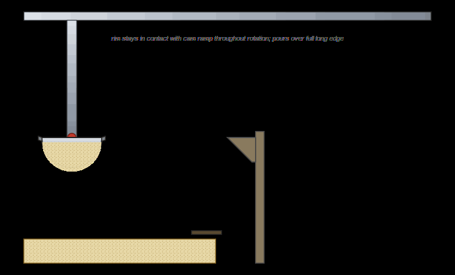
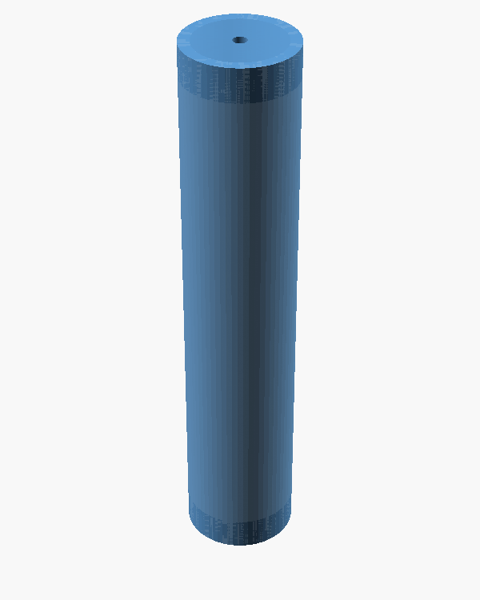

<!-- _class: title -->
<!-- _paginate: false -->

# We got from a hand sketch to a printed auger by treating a coding agent like a junior engineer.

**powder-excavator** — project wrap-up

Sterling Baird · Devora Najjar · Ron
*with Nasa's help on the Ultimaker print*

vertical-cloud-lab · April 2026

---

# Dispensing micron powders at mg–μg precision is dominated by surface forces, not gravity.

- Target dose range: **micrograms to milligrams** of micron-sized solid powders
- Hardware on hand: a Genmitsu 3018-PROVer V2 gantry and a 3D printer
- One workshop week, a small team (Sterling, Devora, Ron), one coding agent

> A 3D-printed scoop will retain powder on its walls after dumping —
> electrostatics and van der Waals dominate at this scale.
> *— Devora's technical-viability writeup, issue #3*

---

# We started from a dip-and-dump scoop sketch on the gantry.

<!-- _class: image-only -->

Issue #1 — the original mechanical concept: a pivoted scoop on a gantry, no second axis on the bucket.

---

# We animated the side view to make the kinematics concrete.

<!-- _class: image-only -->

PR #2 — `mechanism.gif`, generated from the parametric CadQuery model.
Pure-X gantry motion → wall ramp → trough rotation about the pin → dump.

---

# Six candidate powders immediately showed bridging, channeling, and clinging.

<!-- _class: image-only -->

Issue #15 — rice flour, brown rice flour, sodium alginate, calcium lactate, CMC, and xanthan gum, tested by hand.

---

# Before: the agent rejected real CAD options on a single criterion.

### PR #2 — early verdict

> chosen over Rhino/Grasshopper, Fusion, nTop, Onshape because it's pure-Python and pip-installable — none of the others survive the "freshly-cloned repo on a CI runner" test

One-line dismissal. No install attempt. No scoreboard.

### Issue #6 — pushback

> You have a full dev environment. Try to install each of these. If you really can't do anything meaningful in a 60-minute session, that's one thing — but show me.

The fix wasn't a smarter model. It was an instruction to **try**.

---

# After: the agent installed each option, scored them, and changed its own recommendation.

### PR #7 — evidence-based scoreboard

- **CadQuery** + **build123d** (pure-Python, OCP/OpenCascade) → primary
- **OpenSCAD** / **Grasshopper** → alternates
- **Fusion Generative Design** → genuinely doesn't fit CI
- **rhino3dm** → read/write `.3dm` only, no STEP

Verdict per tool, with install logs.

### Concrete deliverables

- STEP export wired in alongside STL
- 3MF preferred over STL on the Cura path
- Both **PrusaSlicer** and **CuraEngine** CLIs added (PR #16)

trajectory: <b>#2</b> → #6 → #7 → #16

---

# Edison Scientific acted as an external reviewer, not just a search tool.

### What Edison did

- PR #2: introduction-grade powder-handling literature synthesis
- PR #7: independent corroboration of the CAD-tool scoreboard
- PR #14: turned `data_entry` uploads into a review loop for CAD, code, and figures

### What Edison surfaced (we had missed)

- **build123d** — sibling to CadQuery on the same OCP kernel
- **Will It Print** (Budinoff 2021) — five validated AM-DFM checks
- **Jubilee + balance + OpenCV + Ax/BoTorch** as the canonical open-hardware closed-loop rig (cited as inspiration, not built here)

---

# A bistable snap-through trough was a sibling concept we tried and parked.

<!-- _class: image-only -->

PR #5 — parametric OpenSCAD + FEA cross-check. Peak snap **2.36 N**, wells at **±1.9 mm**. Parked because it didn't fit the workshop budget — kept on the shelf.

---

# When the snap-through didn't fit, we generated eight alternatives in one panel.

<!-- _class: image-only -->

PR #13 — sieve cup, Pez strip, capillary dip, brush pickup, salt-shaker, passive auger, ERM-augmented sieve, solenoid-tap. Edison promoted the ERM-augmented sieve on published vibratory-sieve evidence (Besenhard 2015).

---

# Powder behavior forced a pivot from a scoop to a vertical Archimedes auger.

### Why we pivoted (issue #1, in-person conversation)

> **Devora, Ron, and I talked.** We're moving towards a vertical auger / Archimedes screw — based system with a sieve at the end, possibly a solenoid for tapping and a small disc vibration motor.

**Dose ≈ rotations × pitch.** Sieve decouples flow from release; tap solenoid + ERM motor break electrostatic clinging. Devora opened **PR #16** with the initial OpenSCAD auger.

---

# The final part is a closed-tube auger printed on the Ultimaker 3 Extended.

<!-- _class: image-only -->

PR #16 (Devora's CAD) — `cad/auger/archimedes-auger.{stl,stp}`, sliced for both Ultimaker and Ender‑3, printed with Nasa's help.
*Outer tube shown; the internal helix is hidden inside the print.*

---

# The print video confirms the auger geometry was manufacturable.

<!-- _class: image-only -->

<video src="assets/final-print-video.mp4" poster="assets/final-print-on-ultimaker.jpg" controls autoplay muted loop playsinline style="max-height:64vh; display:block; margin:0 auto;"></video>

PR #16 — print in progress on the Ultimaker 3 Extended (Nasa ran the print). *(In the HTML build the MP4 plays inline; the GIF on the next slide preserves the motion in the PDF.)*

---

# Same moment, GIF version, so the PDF carries the same signal as the HTML.

<!-- _class: image-only -->

PR #16 — print in progress on the Ultimaker 3 Extended (Nasa ran the print).

---

# The lesson generalizes: the agent improves when you ask it to *try* tools, not just *recommend* them.

- "Pure-Python only" → installed every CAD tool, kept logs, and revised the recommendation.
- "I can't reach Edison from the sandbox" → Edison key + endpoint added to `copilot-instructions.md`; queries fired async, results fetched next session.
- "STL only" → STL **and** STEP **and** 3MF, plus PrusaSlicer **and** CuraEngine g-code per printer.

The unlock was process, not capability.

covered: #1 · #2 · #3 · #5 · #6 · #7 · #13 · #14 · #15 · #16 · #17 · #18

---

# Next time, we would front-load tooling, review, and export discipline.

1. **Give the agent CAD + slicer tools on day one** — not after a PR's worth of pushback.
2. **Treat Edison as a peer reviewer from the start** — fire the literature query before writing the design doc, not after.
3. **Always export the BREP (STEP) alongside the mesh** — a one-line cost that keeps CAM, FreeCAD Path, and archival on the table.

---

<!-- _class: title -->
<!-- _paginate: false -->

# Thanks.

Repo: `vertical-cloud-lab/powder-excavator`
Final design: PR #16 · Wrap-up: PR #18 · Issue: #17
