# Representative images of commercial powder-dispensing platforms

One representative photograph per platform named in
[`../commercial-powder-dispensing-landscape.md`](../commercial-powder-dispensing-landscape.md)
and the second-batch Edison queries in
[`../edison_queries.json`](../edison_queries.json).

Each image is a representative product photograph fetched from the
vendor's own website where possible, and otherwise from a reseller,
trade-press, or industry directory page that hosts the vendor's marketing
photo. Images are stored here for **non-commercial research and editorial
reference only** to support the comparative analysis in this repository;
all rights remain with the respective vendors / photographers.
Source URL and originating page for each file are listed below and in
[`_manifest.json`](./_manifest.json).

If you are the rights-holder for any image and would like it removed or
replaced, please open an issue.

Total images: **40**.

A composite figure of all 40 panels (with (a)–(an) labels and a caption
keyed to the table below) is available at
[`mosaic.png`](./mosaic.png) and [`mosaic_caption.md`](./mosaic_caption.md).

## Bench-top automated lab dispensers (well-evidenced)

| Platform | Image | Source page | Image URL |
| --- | --- | --- | --- |
| **Mettler Toledo Quantos automated powder dosing** | 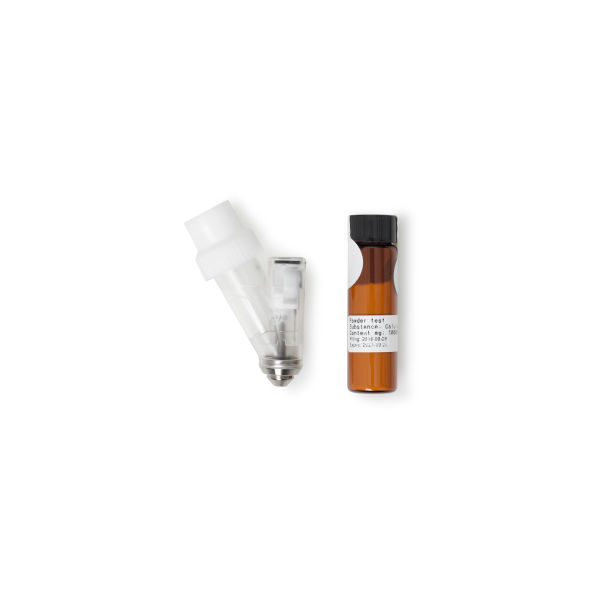 | [link](https://www.mt.com/us/en/home/products/Laboratory_Weighing_Solutions/weighing-accessories/weighing-applications-accessories/dosing-accessories/powder-test-head-11141506.html) | [link](https://www.mt.com/images/WebShop/MainImage/11141506.jpg) |
| **Mettler Toledo Quantos QX96** | 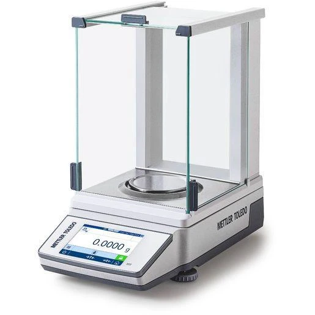 | [link](https://www.scalesplus.com/mettler-toledo-xpr204-analytical-balance/) | [link](https://cdn11.bigcommerce.com/s-errhy7umuu/images/stencil/1280w/products/17263/66531/mettler-toledo-mr204-analytical-balance-220-g-x-0.1-mg-internal-calibration__30704.1732585408.jpg?c=2) |
| **Chemspeed SWING platform** |  | chemspeed.com | [link](https://www.chemspeed.com/_ipx/w_800&fit_cover&f_webp&q_90/assets/cda5bafe-e4d2-432a-994d-5fae0e88da64) |
| **Chemspeed FLEX platform** | 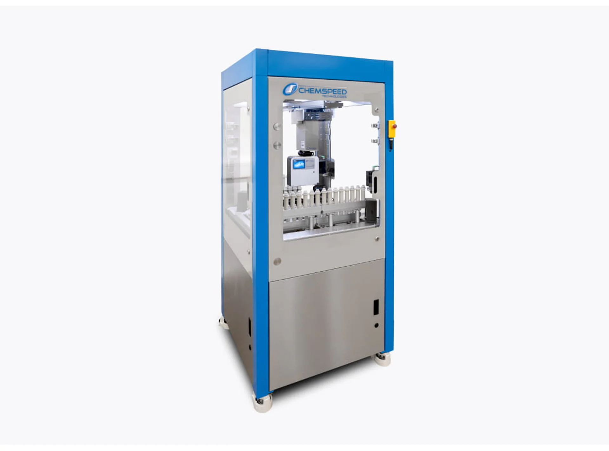 | Bing | [link](https://imagedelivery.net/UakEzlxlDkH0uH3fJuXDug/0aeaa2b6-9da1-4224-f061-efaebc4c7f00/w=1920,fit=cover) |
| **Chemspeed Crystal platform** | 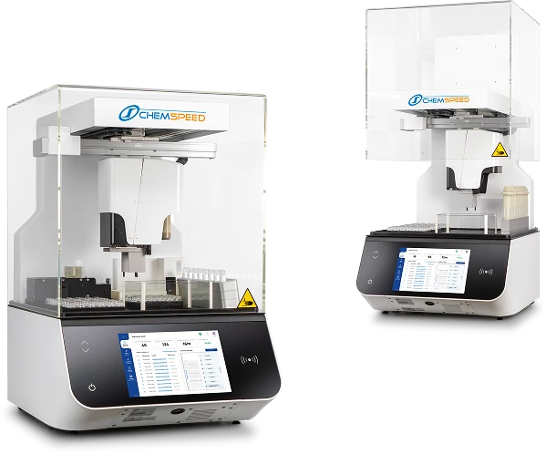 | [link](https://www.chemspeed.com/benchtop-crystal/) | [link](https://www.chemspeed.com/_ipx/w_800&fit_cover&f_webp&q_90/assets/9be0748d-9760-4f15-9473-55b306b16873) |
| **Chemspeed GDU-S SWILE solid-dispensing head** | 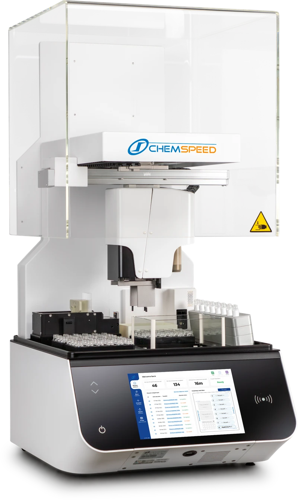 | [link](https://www.chemspeed.com/crystal-swile/) | [link](https://www.chemspeed.com/_ipx/w_800&fit_cover&f_webp&q_90/assets/1a9ec1c9-55b1-488c-83e1-b70243a4e24a) |
| **Chemspeed GDU-Pfd powder hopper / auger head** |  | [link](https://www.chemspeed.com/solid-dispensing/) | [link](https://imagedelivery.net/UakEzlxlDkH0uH3fJuXDug/79e5e9d0-1d69-48f5-a6de-38ff598b4900/w=800) |
| **Unchained Labs / Freeslate Core Module** | 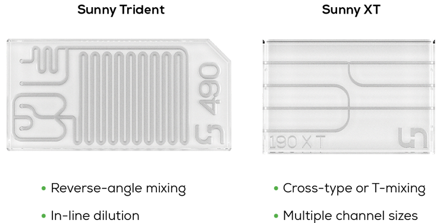 | unchainedlabs.com | [link](https://www.unchainedlabs.com/wp-content/uploads/2023/09/Sunny-Trident-490-bullets_Sunny-190-XT_Combo.png) |
| **Symyx combinatorial workstation** | 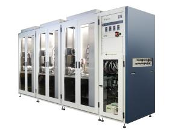 | engineerlive.com | [link](https://www.engineerlive.com/sites/engineerlive/files/styles/article/public/symyxpr11-imageA.jpg?itok=J0cT2tqx) |

## Liquid-handling / balance platforms with possible solid-dispensing modules

| Platform | Image | Source page | Image URL |
| --- | --- | --- | --- |
| **Hamilton Microlab STAR liquid handler** | 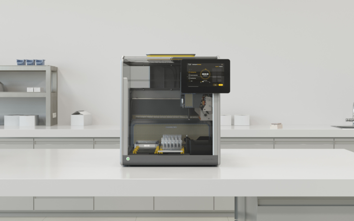 | Hamilton Company | [link](https://craft-robotics.s3.amazonaws.com/_thumbnail/Microlab-Prep-in-a-Lab.jpg?mtime=20190802130657) |
| **Tecan Fluent automation workstation** | 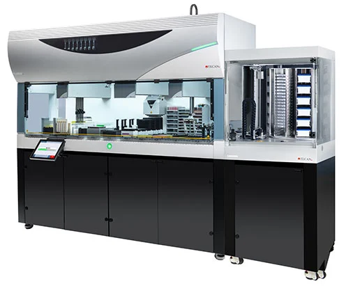 | [link](https://lifesciences.tecan.com/fluent-laboratory-automation-workstation) | [link](https://lifesciences.tecan.com/hs-fs/hubfs/page_images/Fluent/Fluent-instrument-780_zoom_v03.jpg?width=1240&name=Fluent-instrument-780_zoom_v03.jpg) |
| **Tecan Freedom EVO** | 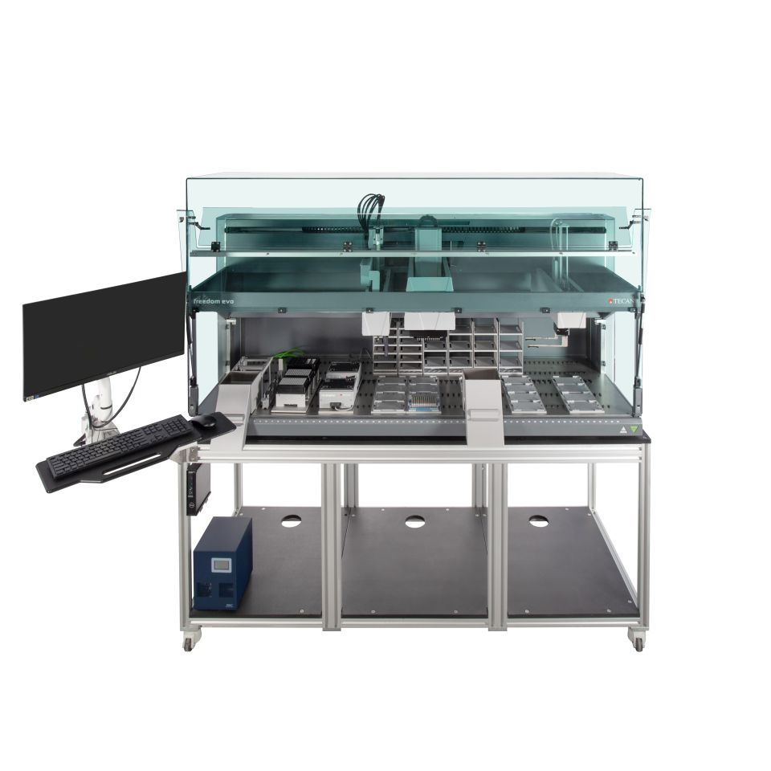 | labx.com | [link](https://cdn.labx.com/v2/images/catalog/product/5291293/SCP-d19f9885-54f7-4f04-afab-22adfbec9567.webp) |
| **Zinsser Analytic Lissy** |  | zinsser-analytic.com | [link](https://azure-na-images.contentstack.com/v3/assets/blt9c3fcc15eb612ed8/blt5f815f53bfee37b8/6864e14ddc2235d0135686fa/d232b7da-13a7-4432-zinsser-worldwide-location_banner.jpg?format=pjpeg&width=8000&quality=50&auto=webp) |
| **Gilson PIPETMAX** | 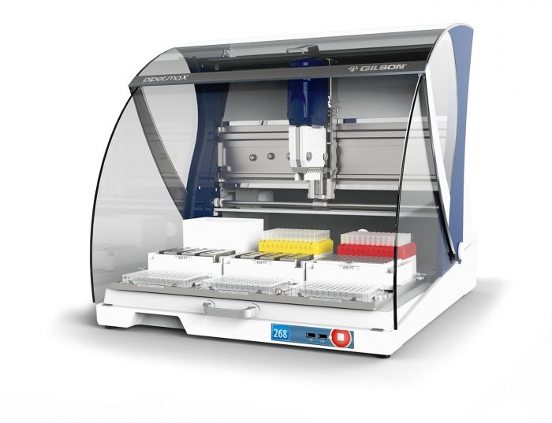 | Bing | [link](https://biolabshop.dk/images/gilson/MAIN_PIPETMAX_1-p.jpg) |
| **Sartorius Cubis II MCA balance** | 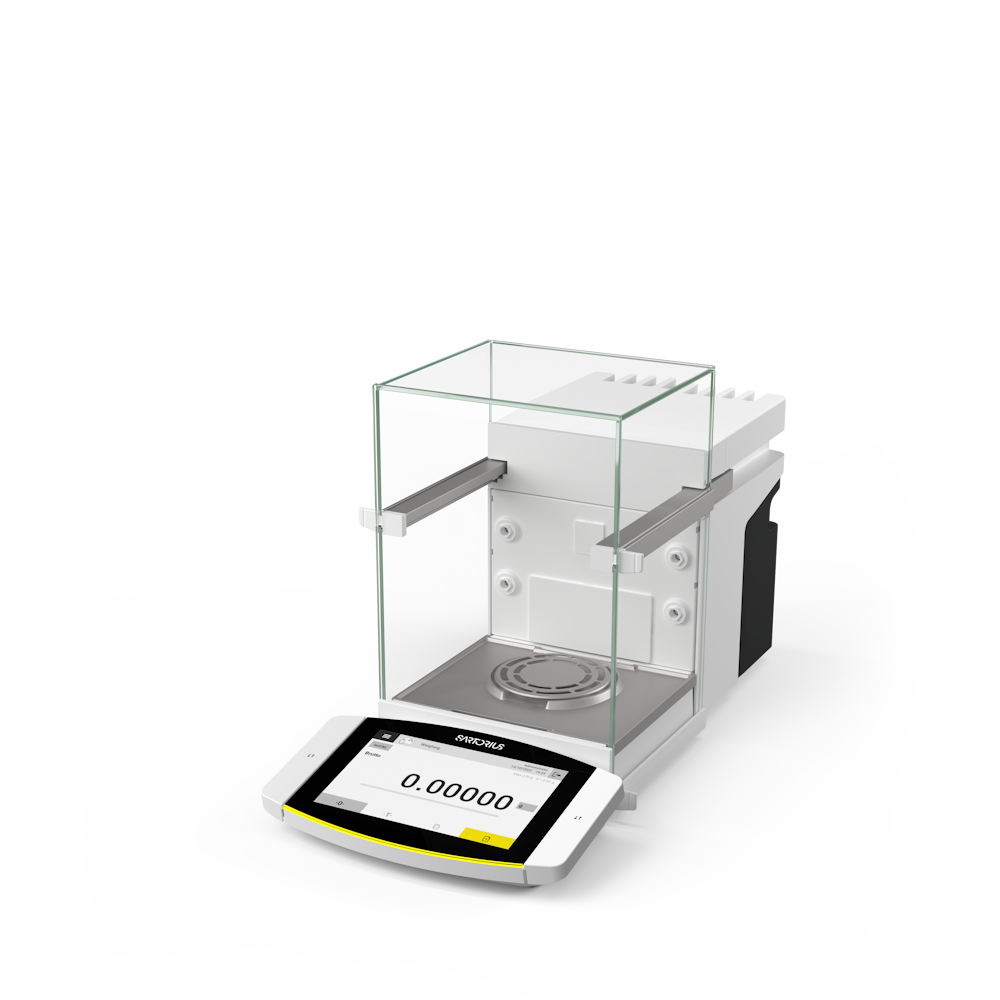 | balance.sartorius.com | [link](https://balance.sartorius.com/statics/cubis-configurator-images/FU_MCA_225S_90mm.png) |
| **Analytik Jena CyBio FeliX** | 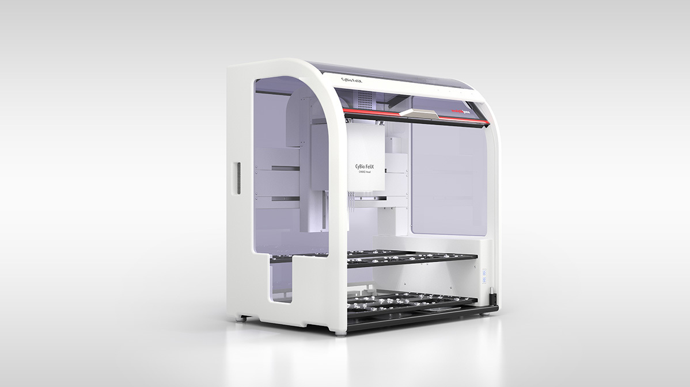 | [link](https://www.analytik-jena.com/products/liquid-handling-automation/laboratory-equipment/automated-liquid-handlers-alh/cybio-felix-series/) | [link](https://www.analytik-jena.com/import/_processed_/9/f/csm_12563215_Felix_CHOICE_WS_02159550e8.jpg) |
| **Anton Paar MCR rheometer (powder cell accessories)** | 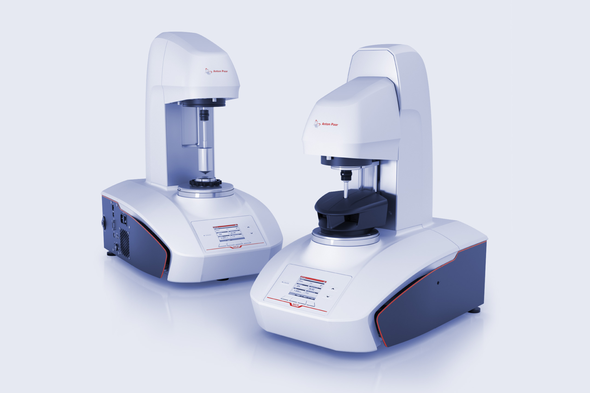 | [link](https://www.anton-paar.com/corp-en/products/details/rheometer-mcr-72-and-mcr-92/) | [link](https://www.anton-paar.com/fileadmin/products/17730_Modular-Compact-Rheometer-MCR-72/key-features/Productpage_Key_features_2400x1600_MCR_72_92_01.jpg) |

## Industrial loss-in-weight / bulk powder handling

| Platform | Image | Source page | Image URL |
| --- | --- | --- | --- |
| **Coperion K-Tron KT20 LIW feeder** | 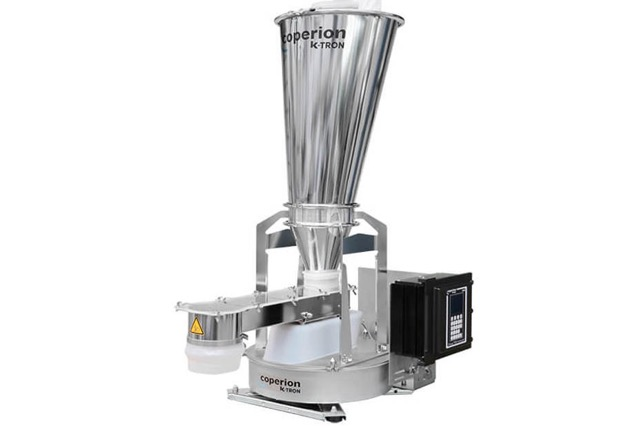 | fhn.coperion.com | [link](https://fhn.coperion.com/wp-content/uploads/2025/10/a_k3-hd-ml-d5-v200-closed_coperion_k-tron-Medium.jpeg) |
| **Coperion K-Tron MT12 micro feeder** | 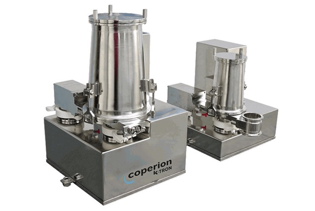 | fhn.coperion.com | [link](https://fhn.coperion.com/wp-content/uploads/2025/10/product_two-microfeeders-Medium.jpeg) |
| **Schenck Process / AccuRate feeder** | 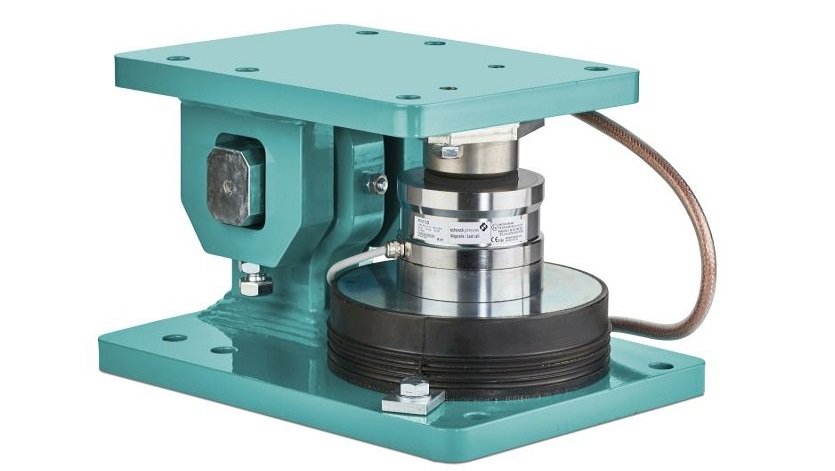 | shop.schenckprocess.com | [link](https://shop.schenckprocess.com/media/.renditions/wysiwyg/Compact_Mounts_SSM_2.jpg) |
| **Brabender Technologie feeder** | 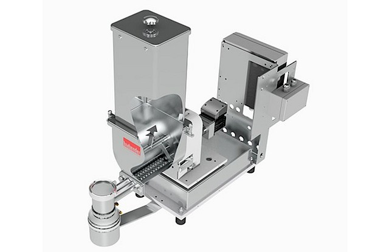 | Bing | [link](https://www.brabender-technologie.com/site/assets/files/99641/ddsr20_d.640x0.jpg) |
| **Gericke GAC continuous feeder** | 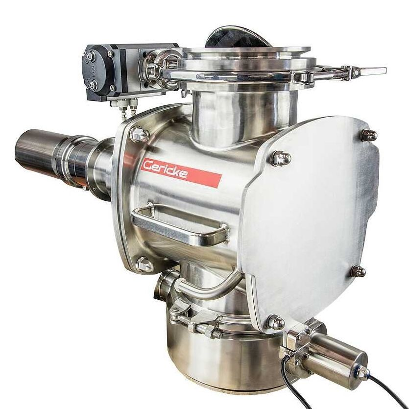 | directindustry.com | [link](https://img.directindustry.com/images_di/photo-g/16064-19500787.jpg) |
| **GEA Buck split butterfly valve** | 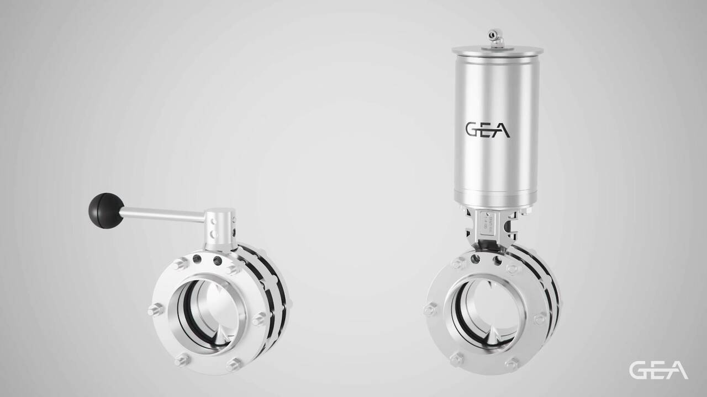 | video.gea.com | [link](https://video.gea.com/10820436/11453071/984724fc3d3586a6d2859c9ba13cb59c/large/gea-hygienic-butterfly-valves-9-thumbnail.jpg) |
| **Glatt containment / fluid bed** | 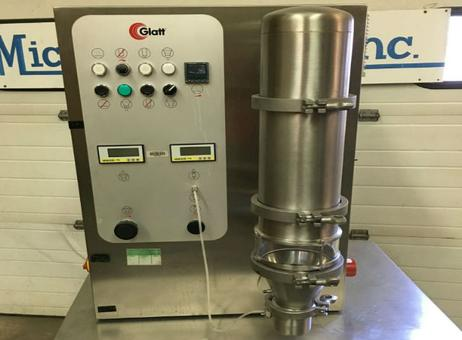 | Bing | [link](https://media.exapro.com/product/2024/03/P240312462/8d681f36a57a1e291302c87d8dae97b5/462x340/glatt-mini5-p240312462_4.jpg) |
| **Hosokawa Micron IBC system** | 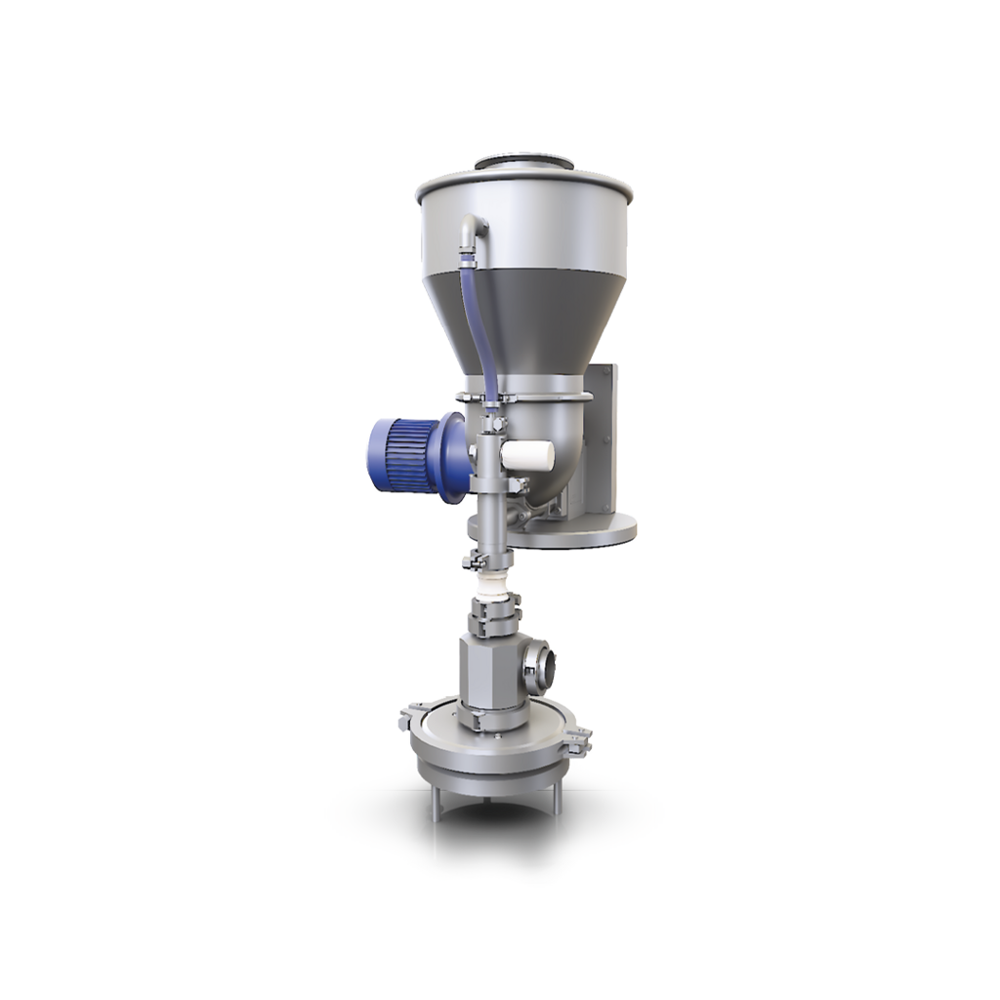 | [link](https://www.hosokawa-alpine.com/) | [link](https://www.hosokawa-alpine.com/fileadmin/_processed_/2/5/csm_Alpine-Microburst-AMB_6fce718267.png) |
| **Acrison Model 105 weigh feeder** | 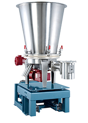 | [link](https://acrison.com/acrison/product-lines/weigh-feeders/weight-loss-weigh-feeder-model-407x/) | [link](https://acrison.com/acrison/assets/Image/im_pro_wf_407.jpg) |
| **Hapman Helix flexible screw conveyor** | 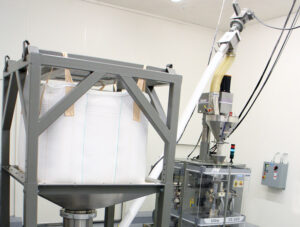 | [link](https://hapman.com/post_products/helix-flexible-screw-conveyor/) | [link](https://hapman.com/wp-content/uploads/2022/07/Hapman-Helix-at-Guixens-Food-Group-Plant-Cropped-300x227.jpg) |
| **AZO COMPONENTER micro-component weighing** | 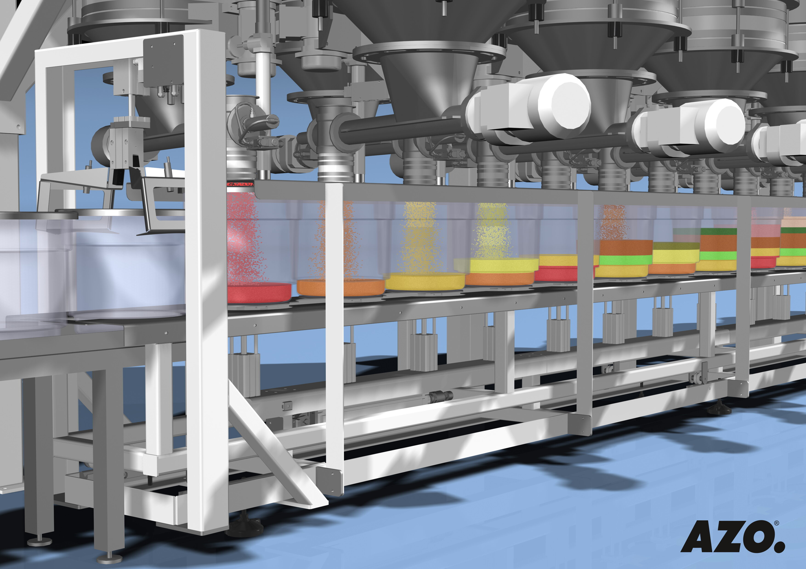 | azo.com | [link](https://www.azo.com/PIM_neu/4135/image-thumb__4135__pimContent/B0377-03d.jpg) |
| **Powder Systems Limited (PSL) GFD isolator** |  | [link](https://www.powdersystems.com/) | [link](https://www.powdersystems.com/wp-content/uploads/2021/04/GFD-in-a-Clinical-setting-on-benchtop-3.jpg) |
| **Matcon IBC with cone valve** | 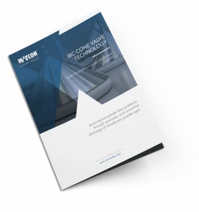 | matconibc.com | [link](https://www.matconibc.com/hs-fs/hubfs/cone-valve-technology-brochure-_1_.webp?width=281&height=300&name=cone-valve-technology-brochure-_1_.webp) |

## MTI (two distinct companies)

| Platform | Image | Source page | Image URL |
| --- | --- | --- | --- |
| **MTI Corporation automatic powder weighing station** | 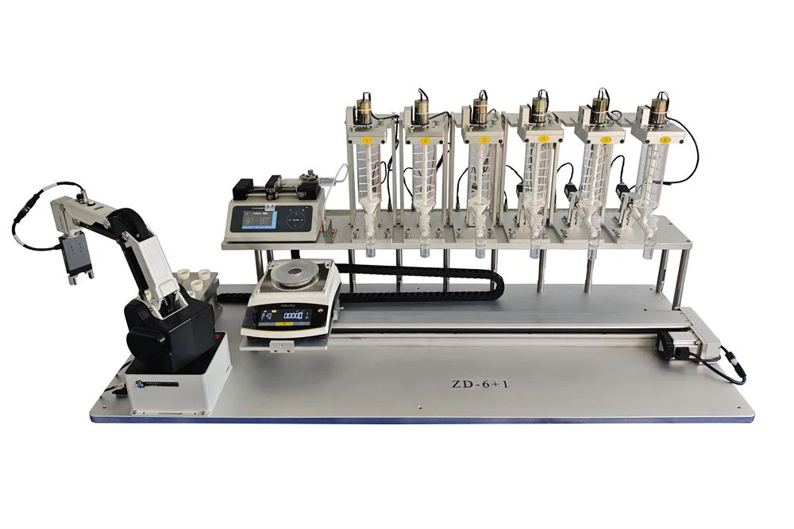 | mtixtl.com | [link](https://mtixtl.com/cdn/shop/files/AM-PD6-main-1.jpg?v=1734551168&width=1445) |
| **MTI Mixer Vertical High-Speed Mixer Type M (MTI Mischtechnik International / MTI America)** | 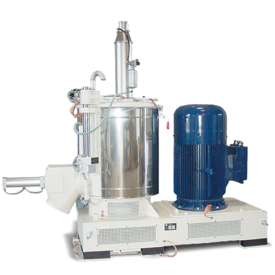 | [link](https://www.mti-mixer.de/en/products/mixers/vertical-high-speed-mixer-type-m/) | [link](https://www.mti-mixer.de/fileadmin/_processed_/e/c/csm_vertikal-schnellmischer-typ-m_600px_a0628b3cbe.png) |

## Micro-dose / specialised feeders (Hou 2024 comparison set)

| Platform | Image | Source page | Image URL |
| --- | --- | --- | --- |
| **MG2 Microdose dosing/encapsulation** | 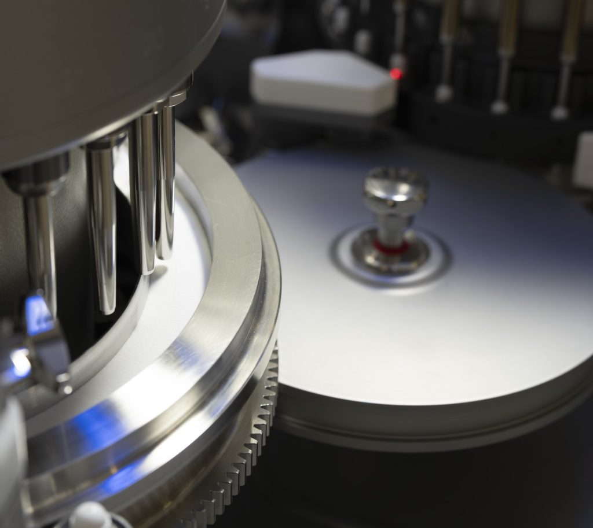 | [link](https://www.mg2.it/processing/) | [link](https://www.mg2.it/wp-content/uploads/2019/08/Essentia-Powder-dosing-unit-1024x913.jpg) |
| **3P Innovation piezo-vibration micro-feeder** | 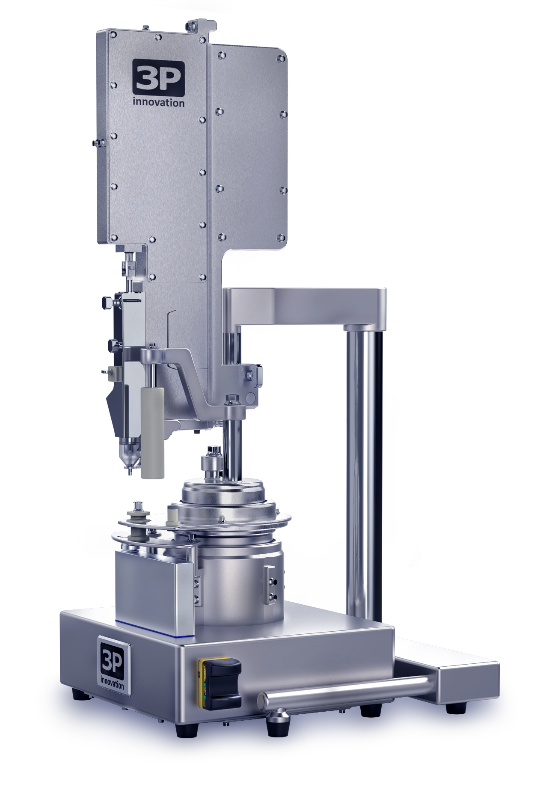 | s3process.co.uk | [link](https://www.s3process.co.uk/wp-content/uploads/2022/06/LabF2W-16Aug2021-1.png) |
| **LCI Circle Feeder MD-120** | 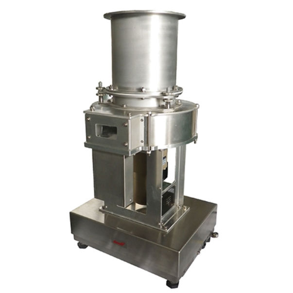 | [link](https://www.directindustry.com/prod/lci/product-207713-2112311.html) | [link](https://img.directindustry.com/images_di/photo-g/207713-14003757.jpg) |
| **DEC µPTS micro powder transfer system** | 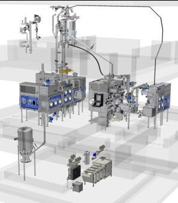 | [link](https://www.directindustry.com/prod/dec-group/product-68500-1625628.html) | [link](https://img.directindustry.com/images_di/photo-g/68500-8586959.jpg) |
| **Vibra-Flow / Vibra Screw vibratory feeder** | 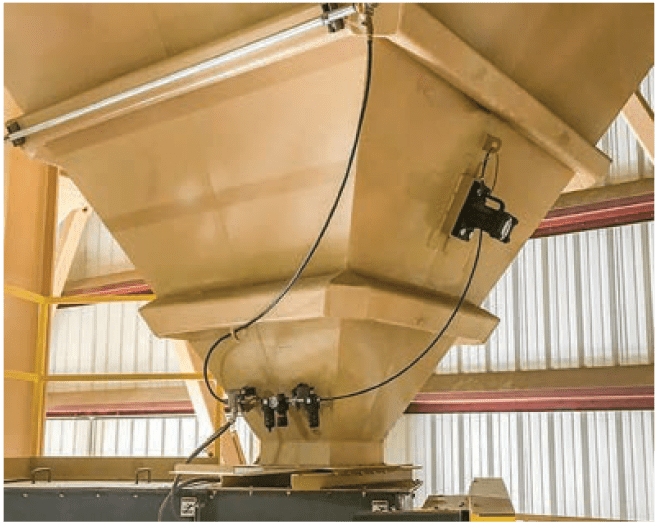 | [link](https://www.vibrascrew.com/bulk-material-handling-products/vibrating-bins/live-bottom-bins/) | [link](https://www.vibrascrew.com/wp-content/uploads/CHE_040124_SP_403423-3.png) |

## Acoustic / piezo (mostly liquid; included for context)

| Platform | Image | Source page | Image URL |
| --- | --- | --- | --- |
| **EDC Biosystems ATS acoustic transfer** |  | Bing | [link](https://cdn.sanity.io/images/f5b6mtfn/selectscience-prod/9d7177cdb26a948bc2bf5513c02afa3859b5e413-640x450.jpg?w=1920&q=75&fit=clip&auto=format) |
| **Labcyte / Beckman Echo acoustic liquid handler** | 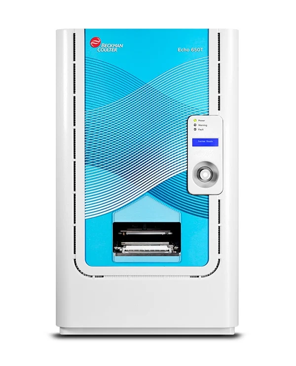 | beckman.com | [link](https://media.beckman.com/-/media/automation/products/instruments/echo-series/echo-650-grey-button/echo-650t-11-2024.jpg?rev=c801ce99de0043caa6dd130e8e8c0998&sc_lang=en-us&la=en-US&h=742&w=600&hash=41A0AC2483835D69916D178508FB006A) |
| **Scienion sciFLEXARRAYER** | 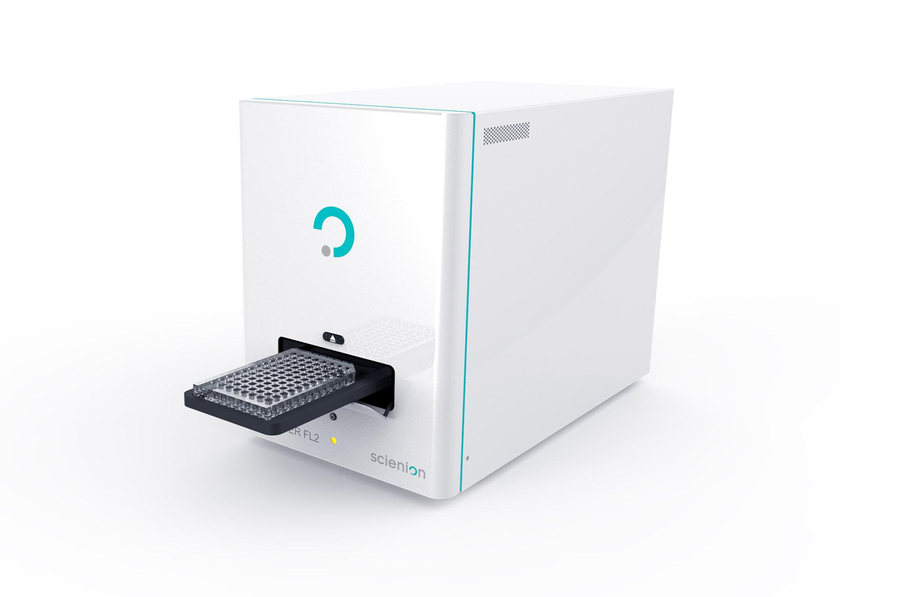 | [link](http://www.scienion.com.cn/Technical-Notes/) | [link](http://www.scienion.com.cn/static/upload/2024/09/03/202409032958.jpg) |

## Reproducing the fetch

The images were collected with a small `ddgs` (DuckDuckGo)
image-search script that constrained results to vendor / reseller
domains and downloaded only `image/*` responses larger than ~12 KB.
Suspicious hits (careers banners, generic stock photos) were re-fetched
with stricter domain allow-lists; the MTI Mixer image was pulled
directly from `mti-mixer.de` after the auto-detected `mtimixer.com`
turned out to be a dead host.
