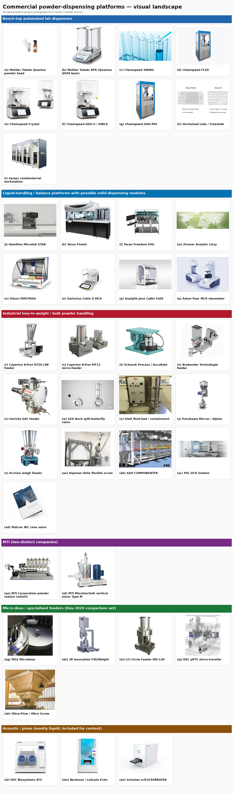

# Mosaic figure caption

**Figure.** Visual landscape of commercial powder-dispensing platforms discussed in [`../commercial-powder-dispensing-landscape.md`](../commercial-powder-dispensing-landscape.md). Panels are grouped by category (coloured banners in the figure) and labelled (a)–(an) in reading order. Each photograph is a representative vendor product image; full source URLs are given below and in [`_manifest.json`](./_manifest.json). Images are reproduced here for non-commercial research / editorial reference; all rights remain with the respective vendors.

### Bench-top automated lab dispensers

- **(a)** Mettler Toledo Quantos powder head — source: <https://www.mt.com/us/en/home/products/Laboratory_Weighing_Solutions/weighing-accessories/weighing-applications-accessories/dosing-accessories/powder-test-head-11141506.html>; image: <https://www.mt.com/images/WebShop/MainImage/11141506.jpg>
- **(b)** Mettler Toledo XPR (Quantos QX96 base) — source: <https://www.scalesplus.com/mettler-toledo-xpr204-analytical-balance/>; image: <https://cdn11.bigcommerce.com/s-errhy7umuu/images/stencil/1280w/products/17263/66531/mettler-toledo-mr204-analytical-balance-220-g-x-0.1-mg-internal-calibration__30704.1732585408.jpg?c=2>
- **(c)** Chemspeed SWING — source: <chemspeed.com>; image: <https://www.chemspeed.com/_ipx/w_800&fit_cover&f_webp&q_90/assets/cda5bafe-e4d2-432a-994d-5fae0e88da64>
- **(d)** Chemspeed FLEX — source: <Bing>; image: <https://imagedelivery.net/UakEzlxlDkH0uH3fJuXDug/0aeaa2b6-9da1-4224-f061-efaebc4c7f00/w=1920,fit=cover>
- **(e)** Chemspeed Crystal — source: <https://www.chemspeed.com/benchtop-crystal/>; image: <https://www.chemspeed.com/_ipx/w_800&fit_cover&f_webp&q_90/assets/9be0748d-9760-4f15-9473-55b306b16873>
- **(f)** Chemspeed GDU-S / SWILE — source: <https://www.chemspeed.com/crystal-swile/>; image: <https://www.chemspeed.com/_ipx/w_800&fit_cover&f_webp&q_90/assets/1a9ec1c9-55b1-488c-83e1-b70243a4e24a>
- **(g)** Chemspeed GDU-Pfd — source: <https://www.chemspeed.com/solid-dispensing/>; image: <https://imagedelivery.net/UakEzlxlDkH0uH3fJuXDug/79e5e9d0-1d69-48f5-a6de-38ff598b4900/w=800>
- **(h)** Unchained Labs / Freeslate — source: <unchainedlabs.com>; image: <https://www.unchainedlabs.com/wp-content/uploads/2023/09/Sunny-Trident-490-bullets_Sunny-190-XT_Combo.png>
- **(i)** Symyx combinatorial workstation — source: <engineerlive.com>; image: <https://www.engineerlive.com/sites/engineerlive/files/styles/article/public/symyxpr11-imageA.jpg?itok=J0cT2tqx>

### Liquid-handling / balance platforms with possible solid-dispensing modules

- **(j)** Hamilton Microlab STAR — source: <Hamilton Company>; image: <https://craft-robotics.s3.amazonaws.com/_thumbnail/Microlab-Prep-in-a-Lab.jpg?mtime=20190802130657>
- **(k)** Tecan Fluent — source: <https://lifesciences.tecan.com/fluent-laboratory-automation-workstation>; image: <https://lifesciences.tecan.com/hs-fs/hubfs/page_images/Fluent/Fluent-instrument-780_zoom_v03.jpg?width=1240&name=Fluent-instrument-780_zoom_v03.jpg>
- **(l)** Tecan Freedom EVO — source: <labx.com>; image: <https://cdn.labx.com/v2/images/catalog/product/5291293/SCP-d19f9885-54f7-4f04-afab-22adfbec9567.webp>
- **(m)** Zinsser Analytic Lissy — source: <zinsser-analytic.com>; image: <https://azure-na-images.contentstack.com/v3/assets/blt9c3fcc15eb612ed8/blt5f815f53bfee37b8/6864e14ddc2235d0135686fa/d232b7da-13a7-4432-zinsser-worldwide-location_banner.jpg?format=pjpeg&width=8000&quality=50&auto=webp>
- **(n)** Gilson PIPETMAX — source: <Bing>; image: <https://biolabshop.dk/images/gilson/MAIN_PIPETMAX_1-p.jpg>
- **(o)** Sartorius Cubis II MCA — source: <balance.sartorius.com>; image: <https://balance.sartorius.com/statics/cubis-configurator-images/FU_MCA_225S_90mm.png>
- **(p)** Analytik Jena CyBio FeliX — source: <https://www.analytik-jena.com/products/liquid-handling-automation/laboratory-equipment/automated-liquid-handlers-alh/cybio-felix-series/>; image: <https://www.analytik-jena.com/import/_processed_/9/f/csm_12563215_Felix_CHOICE_WS_02159550e8.jpg>
- **(q)** Anton Paar MCR rheometer — source: <https://www.anton-paar.com/corp-en/products/details/rheometer-mcr-72-and-mcr-92/>; image: <https://www.anton-paar.com/fileadmin/products/17730_Modular-Compact-Rheometer-MCR-72/key-features/Productpage_Key_features_2400x1600_MCR_72_92_01.jpg>

### Industrial loss-in-weight / bulk powder handling

- **(r)** Coperion K-Tron KT20 LIW feeder — source: <fhn.coperion.com>; image: <https://fhn.coperion.com/wp-content/uploads/2025/10/a_k3-hd-ml-d5-v200-closed_coperion_k-tron-Medium.jpeg>
- **(s)** Coperion K-Tron MT12 micro-feeder — source: <fhn.coperion.com>; image: <https://fhn.coperion.com/wp-content/uploads/2025/10/product_two-microfeeders-Medium.jpeg>
- **(t)** Schenck Process / AccuRate — source: <shop.schenckprocess.com>; image: <https://shop.schenckprocess.com/media/.renditions/wysiwyg/Compact_Mounts_SSM_2.jpg>
- **(u)** Brabender Technologie feeder — source: <Bing>; image: <https://www.brabender-technologie.com/site/assets/files/99641/ddsr20_d.640x0.jpg>
- **(v)** Gericke GAC feeder — source: <directindustry.com>; image: <https://img.directindustry.com/images_di/photo-g/16064-19500787.jpg>
- **(w)** GEA Buck split-butterfly valve — source: <video.gea.com>; image: <https://video.gea.com/10820436/11453071/984724fc3d3586a6d2859c9ba13cb59c/large/gea-hygienic-butterfly-valves-9-thumbnail.jpg>
- **(x)** Glatt fluid-bed / containment — source: <Bing>; image: <https://media.exapro.com/product/2024/03/P240312462/8d681f36a57a1e291302c87d8dae97b5/462x340/glatt-mini5-p240312462_4.jpg>
- **(y)** Hosokawa Micron / Alpine — source: <https://www.hosokawa-alpine.com/>; image: <https://www.hosokawa-alpine.com/fileadmin/_processed_/2/5/csm_Alpine-Microburst-AMB_6fce718267.png>
- **(z)** Acrison weigh feeder — source: <https://acrison.com/acrison/product-lines/weigh-feeders/weight-loss-weigh-feeder-model-407x/>; image: <https://acrison.com/acrison/assets/Image/im_pro_wf_407.jpg>
- **(aa)** Hapman Helix flexible screw — source: <https://hapman.com/post_products/helix-flexible-screw-conveyor/>; image: <https://hapman.com/wp-content/uploads/2022/07/Hapman-Helix-at-Guixens-Food-Group-Plant-Cropped-300x227.jpg>
- **(ab)** AZO COMPONENTER — source: <azo.com>; image: <https://www.azo.com/PIM_neu/4135/image-thumb__4135__pimContent/B0377-03d.jpg>
- **(ac)** PSL GFD isolator — source: <https://www.powdersystems.com/>; image: <https://www.powdersystems.com/wp-content/uploads/2021/04/GFD-in-a-Clinical-setting-on-benchtop-3.jpg>
- **(ad)** Matcon IBC cone valve — source: <matconibc.com>; image: <https://www.matconibc.com/hs-fs/hubfs/cone-valve-technology-brochure-_1_.webp?width=281&height=300&name=cone-valve-technology-brochure-_1_.webp>

### MTI (two distinct companies)

- **(ae)** MTI Corporation powder station (mtixtl) — source: <mtixtl.com>; image: <https://mtixtl.com/cdn/shop/files/AM-PD6-main-1.jpg?v=1734551168&width=1445>
- **(af)** MTI Mischtechnik vertical mixer Type M — source: <https://www.mti-mixer.de/en/products/mixers/vertical-high-speed-mixer-type-m/>; image: <https://www.mti-mixer.de/fileadmin/_processed_/e/c/csm_vertikal-schnellmischer-typ-m_600px_a0628b3cbe.png>

### Micro-dose / specialised feeders (Hou 2024 comparison set)

- **(ag)** MG2 Microdose — source: <https://www.mg2.it/processing/>; image: <https://www.mg2.it/wp-content/uploads/2019/08/Essentia-Powder-dosing-unit-1024x913.jpg>
- **(ah)** 3P Innovation Fill2Weight — source: <s3process.co.uk>; image: <https://www.s3process.co.uk/wp-content/uploads/2022/06/LabF2W-16Aug2021-1.png>
- **(ai)** LCI Circle Feeder MD-120 — source: <https://www.directindustry.com/prod/lci/product-207713-2112311.html>; image: <https://img.directindustry.com/images_di/photo-g/207713-14003757.jpg>
- **(aj)** DEC µPTS micro-transfer — source: <https://www.directindustry.com/prod/dec-group/product-68500-1625628.html>; image: <https://img.directindustry.com/images_di/photo-g/68500-8586959.jpg>
- **(ak)** Vibra-Flow / Vibra Screw — source: <https://www.vibrascrew.com/bulk-material-handling-products/vibrating-bins/live-bottom-bins/>; image: <https://www.vibrascrew.com/wp-content/uploads/CHE_040124_SP_403423-3.png>

### Acoustic / piezo (mostly liquid; included for context)

- **(al)** EDC Biosystems ATS — source: <Bing>; image: <https://cdn.sanity.io/images/f5b6mtfn/selectscience-prod/9d7177cdb26a948bc2bf5513c02afa3859b5e413-640x450.jpg?w=1920&q=75&fit=clip&auto=format>
- **(am)** Beckman / Labcyte Echo — source: <beckman.com>; image: <https://media.beckman.com/-/media/automation/products/instruments/echo-series/echo-650-grey-button/echo-650t-11-2024.jpg?rev=c801ce99de0043caa6dd130e8e8c0998&sc_lang=en-us&la=en-US&h=742&w=600&hash=41A0AC2483835D69916D178508FB006A>
- **(an)** Scienion sciFLEXARRAYER — source: <http://www.scienion.com.cn/Technical-Notes/>; image: <http://www.scienion.com.cn/static/upload/2024/09/03/202409032958.jpg>

Per-panel sources are also available row-by-row in [`README.md`](./README.md).